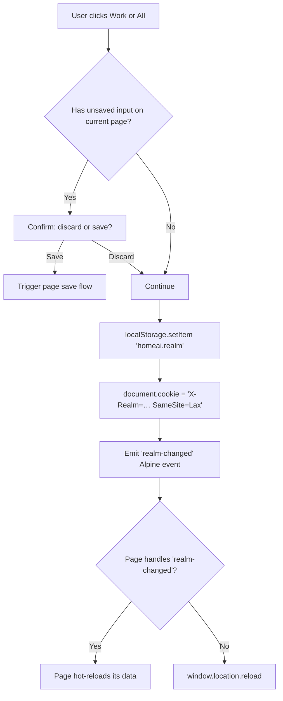

# U84 — Home AI dashboard UX restructure (long-form refinement — Gemini-reviewed)

> **Status:** Gemini critique returned 2026-05-15 with 6 architectural issues (Workspace paradox, cross-tab race, connection leak, fragile optimistic UI, phase ordering, offline vulnerability). All 6 absorbed into the plan below. Two additional directives from Jo also absorbed: (a) realm toggle changed from `[Work | Private]` to `[Work | All]` so it has meaning on every screen including Build/All, (b) unified date picker modality across every screen that touches time-bound data.
>
> Updated sections are flagged **`[Rev. post-Gemini]`** inline. New sections at §24 (unified date picker) and §25 (vendor + offline strategy). See §3.1 for the consolidated change summary.
>
> **For export to Gemini (or any other reviewer):** this file is self-contained. Paste the whole thing into the model context. The reviewer's job is to challenge the IA, the realm toggle, the design tokens, and the phase ordering — not to research the codebase. All code paths, SQL, and conventions needed to reason about the changes are inline.

---

## 0 · One-page summary

**What's broken:** dashboard has 23 flat HTML pages and 58 API endpoints with no information architecture. Hardware tiles, finance KPIs, agent queues, and weather all share `/index`. Private/family data and business data co-mingle visually because there's no realm switcher at the UI layer.

**What we're building:** a 4-bucket mental model (`Work | Private | Build | All`) with a **realm toggle in the header** that drives data filtering server-side via the existing `X-Realm` header path. Mobile-first; desktop is the same tiles wider. Dark glassmorphic theme retained — the visual language is the only thing that doesn't change.

**Why these four buckets:** Jo runs three businesses + a family + an AI. Each has a different cadence and answers different questions. "What did the pub take last night" and "When is Mae's dentist appointment" are not the same question and should not share a screen.

**Non-negotiables:**
- Realm enforcement stays server-side (RLS already enforces it; UI only sets a header).
- Existing URLs continue to resolve (301-redirect to the new IA) so cron jobs and Tampermonkey scripts don't break.
- No new CSS framework, no JS build step, no theme swap.

**Total estimated effort:** 32h across 7 phases, plus a hardening Phase 8 (a11y + perf budget) added by this refinement → 40h end-to-end.

---

## 1 · Project context (just enough for the reviewer)

### Repository

- **Code root:** `/home_ai/` (off-host single-machine deployment). Mirror at `git@github.com:jolyonsandercock-oss/HomeAI`.
- **This file lives at:** `/home/joly/.claude/plans/u84-ultraplan-substitute.md` (local). The Ultraplan handoff branch is `origin/plans-home` on HomeAI.

### Stack

| Layer | Tech | Why |
|---|---|---|
| Server | FastAPI (Python 3.12) | Single file: `services/build-dashboard/main.py` (~5,000 LOC). Async, type-hinted, asyncpg pool. |
| DB | Postgres 16 (single instance) | Schemas: `public`, `mart`, `raw`, `staging`. RLS enforced per realm via `set_config('app.current_realm', …)`. ~60 tables + ~60 views. |
| Template | Jinja2 SSR + Alpine.js + Tailwind (CDN) + Tabulator (CDN) | No build step. Each `static/*.html` is a self-contained page. |
| Auth | Authelia + Caddy forward_auth | Sets `Remote-User`, `Remote-Groups`. App reads these in the realm middleware. |
| AI | Anthropic Claude Haiku (extractor), Sonnet (rescuer/responder), Opus (planner). Ollama (Qwen 2.5:7b) on local for free tier. | |
| Comms | Telegram (critical + interactive), Gmail (5 identities via google-fetch sidecar) | |

### Conventions

- **Slug pattern.** Adding SQL: `INSERT INTO query_whitelist(slug, sql_text)` + add slug name to `_load_finance_slugs` allowlist in `main.py:4854-4866`. Route is then automatically `GET /api/finance/slug/{slug}`. Never write raw SQL inside endpoint code.
- **Alpine component shape.**
  ```html
  <body x-data="myPage()" x-init="boot()">
    …
  </body>
  <script>
  window.myPage = () => ({
    loading: true,
    data: {},
    async boot() { this.data = await (await fetch('/api/foo')).json(); this.loading = false; }
  });
  </script>
  ```
- **CSS atoms.** `.glass` (frosted card), `.tile` (KPI block), `.mono` (numeric), `.pos/.neg` (currency tint), `.tl-green/-amber/-red` (traffic-light status pip). Defined in `static/_shared.css`.
- **Realm middleware.** `main.py:497-529` reads `X-Realm` from the request and calls `home_ai.set_realm(<value>)` on the DB session. Three realms: `owner` (root, sees all), `work` (pub/cafe/estates), `family` (personal/household).

### Authoritative reading order for the reviewer

1. `services/build-dashboard/main.py` — entire app
2. `services/build-dashboard/static/m.html` — the visual language we're extending
3. `services/build-dashboard/static/finance.html` — the KPI banner + tabs pattern
4. `services/build-dashboard/static/agents-ops.html` — what `/build/pipelines` becomes
5. `SPEC.md` — data model + pipelines
6. `postgres/migrations/V99__mortgage_statement_periods.sql` — current shape of a view+slug pair

### Mental model

| Bucket | Realm filter | Who sees it | What it answers |
|---|---|---|---|
| Work | `work` | Jo (today), one day staff via Authelia ACL | "What's the business doing right now?" |
| Private | `family` | Jo + Sophie | "What's our household doing right now?" |
| Build | (none — owner only) | Jo only | "What's the AI doing for me right now?" |
| All | (none — owner only) | Jo only | "Where in the system is the thing I'm looking for?" |

---

## 2 · Goals and non-goals

### Goals

1. **Reduce cognitive load.** A scan of "Today" should answer the single question "Anything I need to do?" in under 3 seconds.
2. **Realm hygiene.** Eliminate every screen where family and work data appear on the same page.
3. **Mobile parity.** Every screen Jo uses operationally must be usable on a 375px viewport. Desktop is allowed to be richer, but not required.
4. **Discoverability.** Long-tail surfaces (forensics, slugs, views) reachable in two taps via the "All" page.
5. **No regression in capability.** Every existing URL still resolves (via 301).

### Non-goals

1. **No new theme.** Dark glassmorphic stays. The visual identity is fine; we're restructuring not redecorating.
2. **No new auth model.** Authelia continues to enforce. We don't add a JWT layer or rewrite session handling.
3. **No new framework.** No React, no Vue, no Svelte. Alpine + Tailwind continues.
4. **No build pipeline.** Continue serving static HTML with CDN'd Tailwind.
5. **No mobile app.** PWA install banner is in scope; React Native or Capacitor is not.
6. **No new data sources.** Every tile is powered by an existing table or view.

---

## 3 · Decisions locked

These are settled in the original plan after Jo answered the AskUserQuestion battery. The reviewer is welcome to challenge them but should be aware they each came from Jo's stated preference, not a default.

| # | Decision | Rationale |
|---|---|---|
| D1 | **Realm toggle in header**, not URL prefix | Existing URLs (`/finance`, `/workforce`, etc.) keep working; toggle just changes header. Less migration risk. |
| D2 | **Mobile-first** for both Work and Private | Jo is at the bar or in the property car park more often than at the desk. |
| D3 | **Build = AI ops + Sovereignty + Forensics** in one bucket | These are all "watching the watchers" surfaces; not blending them with business data prevents context-switching pain. |
| D4 | **All = sitemap with search** | The long tail of detail screens deserves an entry point but not a fixed nav slot. |
| D5 | **Segmented control** (`[Work | Private]`) for the realm toggle, not a dropdown | Two options → segmented control is the canonical pattern (Apple HIG, iOS settings). |
| D6 | **Authelia owner-group gate** on `/build/*` and `/all/*` | Build internals are not for staff; if a future staff member gets a login they shouldn't see model spend or DLQ. |

### Decisions deferred to execution

- **DD1.** When the realm toggle fires with unsaved input on the current page, do we warn? (Likely yes, with a `dirty` guard.)
- **DD2.** Action queue prioritisation: by severity, or by severity × age × £ exposure? (Start with severity; tune after 2 weeks of usage telemetry.)
- **DD3.** `/build/spec` rendering: server-side markdown-it, or iframe a static render? (Server-side preferred; search becomes possible.)
- **DD4.** Can old `/playground`, `/landing`, `/pub` URLs be deleted, or are they referenced externally? (Check `audit_log` for hits in last 30d before deleting.)

---

## 3.1 · Post-Gemini revisions (consolidated change log) `[Rev. post-Gemini]`

Six architectural issues raised by Gemini, plus two additional directives from Jo, are absorbed below. Each is mapped to the section it modifies and a one-line summary of the fix.

| # | Issue | Section affected | Fix summary |
|---|---|---|---|
| G1 | **Workspace paradox** — segmented control has no defined state on `/build/*` or `/all` | §3 D5, §4, §5 | Replace `[Work \| Private]` with `[Work \| All]`. "All" is meaningful everywhere: on Work-bucket pages it shows unfiltered data; on Private-bucket pages it shows everything (including private); on Build/All-bucket pages it controls the realm filter for any data the page surfaces (AI calls by realm, exception lists, etc.). The Private bucket remains in the IA as a focused navigation surface; the toggle still works there. No neutral state required. |
| G2 | **Cross-tab state desync + race conditions** | §4 (client) | (a) Realm captured into Alpine `x-data` at `boot()`, not re-read from `localStorage` on every fetch. (b) Global `storage` event listener forces graceful reload of background tabs when realm changes. (c) Promise-based `realmHandshake` registration replaces the 300ms `setTimeout` fallback — pages register an async handler at boot, the toggle awaits it. |
| G3 | **DB connection leak in middleware** | §4 (server) | Drop the `pool.acquire()` inside `realm_middleware`. Replace with `request.state.realm` only (no pool hold). Each endpoint or repository function acquires + runs `SET LOCAL home_ai.current_realm = …` micro-transactionally. New helper `async with db_session(request.state.realm) as conn:` encapsulates the pattern. |
| G4 | **Fragile optimistic UI** | §10 | Action queue: keep optimistically-removed item in component state with `pendingRollback` flag; on PATCH error, re-insert with red error badge + retry CTA, not just a toast. Drag-and-drop ingest: add explicit `upload_failed` state branch with file-type/size error messaging + retry path. |
| G5 | **Phase ordering churn** | §16 | Move structural a11y (44px tap targets, native form labels, focus-visible ring) and structural performance (aspect-ratio reserved skeletons, lazy-load defers) into Phase 1+2. Phase 8 retained but scoped strictly to automated validation: Playwright runs, axe-core CI gate, Lighthouse CI, notification-system throttle bake-in. |
| G6 | **CDN offline vulnerability** | §12, §19 | Vendor Tailwind (CDN JIT runtime), Alpine.js, Tabulator (JS+CSS), D3, Heroicons (sprite) into `/static/vendor/`. Pin versions in `vendor/MANIFEST.txt`. Service worker pre-caches them in app shell. Phase 1a is the vendoring step. |
| J1 | **Realm toggle on every screen** | §4, §5, §7 | Header partial renders the toggle universally. The toggle is `[Work \| All]` on every page including Build/All — keeping the UI surface identical removes a class of mental-model errors. |
| J2 | **Unified date picker / filter modality** | NEW §24 | One date-window component (`_components/date-window.js`) used on every page that filters by time. Presets (today / yesterday / 7d / 30d / 90d / custom). Persists per-page in localStorage. Emits the existing `@date-window-changed.window` event for backwards compat with current consumers. |

### Updated effort estimate

Phase 1 grew from 3h → ~8h (vendoring + structural a11y/perf bakes in + unified date picker). Phase 2 grew slightly to inherit the patterns. Phase 8 shrank to automated validation only.

| Phase | Was | Now | Delta |
|---|---|---|---|
| 1 — Header + realm toggle + vendor + structural a11y/perf | 3h | 8h | +5h |
| 2 — Today screens (with structural patterns inherited) | 6h | 7h | +1h |
| 3 — Work tabs | 8h | 8h | 0 |
| 4 — Private tabs | 5h | 5h | 0 |
| 5 — Build hub | 4h | 4h | 0 |
| 6 — All / Sitemap | 3h | 3h | 0 |
| 7 — Polish + decommission | 3h | 3h | 0 |
| 8 — Automated validation gate | 8h | 4h | −4h |
| **Total** | **40h** | **42h** | **+2h** |

The +2h is genuine work (vendoring + the date-picker component); the rest is shifting work earlier, not adding it. The result is fewer Phase 8 refactors and a smaller risk surface.

---

## 4 · Realm toggle — the foundational mechanism

This is the load-bearing pattern. Everything else assumes it works. The reviewer should challenge this section hardest.

### Anatomy

```
┌──────────────────────────────────────────────────────────────────────┐
│ ⌂ Home AI │ [▼ Work │ All ] │ Build │ All │ 🔍 search │ ⚙ │ Jo │
└──────────────────────────────────────────────────────────────────────┘
                ↑
                segmented control —
                arrow indicates active realm,
                colour-coded chip behind active option:
                  Work    → amber  (#f59e0b, hsla(38, 92%, 50%, 0.18))
                  All     → green  (#34d399, hsla(160, 64%, 52%, 0.18))
```

### The click flow



### Server side `[Rev. post-Gemini]`

**Why the original pattern is wrong (G3):** wrapping `await call_next(request)` inside `async with pool.acquire()` holds the Postgres connection for the **entire HTTP lifecycle** — template rendering, third-party network waits, slow-client streaming. Under minor concurrency this exhausts the asyncpg pool.

**New middleware (no connection held):**

```python
# main.py — realm middleware (revised)
@app.middleware("http")
async def realm_middleware(request: Request, call_next):
    realm = (
        request.headers.get("X-Realm")
        or request.cookies.get("X-Realm")
        or "all"  # default is now "all" (owner sees everything)
    )
    # Validate: we accept work | all (and 'owner' as legacy alias for 'all')
    if realm not in ("work", "all", "owner", "family"):
        realm = "all"
    if realm == "owner":
        realm = "all"  # legacy → new vocabulary

    # Authelia: non-owner staff are forced to 'work', regardless of cookie
    groups = (request.headers.get("Remote-Groups") or "").split(",")
    if "owner" not in groups and realm != "work":
        realm = "work"

    # Just stash the choice on request.state — DO NOT acquire a connection here
    request.state.realm = realm
    return await call_next(request)
```

**New helper for endpoints (`db_session` context manager):**

```python
# main.py — db helpers (new)
from contextlib import asynccontextmanager

@asynccontextmanager
async def db_session(realm: str, entity: str | None = None):
    """Acquire a pool connection, set realm + entity SET LOCAL,
    then release immediately after the query block exits. This is the
    only correct pattern — never hold a connection across rendering."""
    async with pool.acquire() as conn:
        async with conn.transaction():
            await conn.execute("SELECT home_ai.set_realm($1)", realm)
            if entity is not None:
                await conn.execute(f"SET LOCAL app.current_entity = $1", entity)
            yield conn

# Endpoints use it like this:
@app.get("/api/finance/slug/{slug}")
async def run_slug(slug: str, request: Request):
    async with db_session(request.state.realm) as conn:
        rows = await conn.fetch(QUERY_WHITELIST[slug])
    # Connection is released here, *before* JSON serialisation
    return [dict(r) for r in rows]
```

Key property: the connection is released after `conn.fetch(...)` completes, *before* `dict(r)` serialisation runs. The pool stays drained-fast even under slow-client conditions.

### Migration

- Phase 1d: refactor `realm_middleware` per above + introduce `db_session`.
- Every existing endpoint that uses `request.state.conn` is migrated to `db_session`. There are ~38 such endpoints; grep `request.state.conn` to enumerate.
- During the migration window, both patterns coexist (old endpoints keep their pool hold; new pattern drains correctly). Migration completes inside Phase 1d before Phase 2 begins.

### Client side `[Rev. post-Gemini]`

The original draft had three bugs (G2): live `localStorage` reads inside the fetch interceptor (cross-tab race), no `storage`-event listener (background tabs poison themselves), and a 300ms `setTimeout` fallback (fires when async data fetches are slow). Below is the revised implementation.

**New file `services/build-dashboard/static/_components/realm-toggle.js`:**

```javascript
// Realm toggle — sets X-Realm on every fetch, persists in localStorage + cookie.
// G2 fix: each page captures its booted realm into Alpine state; fetch reads
// from the *captured* value, not live from localStorage. Background tabs are
// reloaded via the storage event. The handshake uses a Promise registration,
// not a setTimeout fallback.
(function () {
  const STORAGE_KEY = 'homeai.realm';
  const COOKIE_KEY  = 'X-Realm';
  const DEFAULT_REALM = 'work';            // first-visit default
  const VALID_REALMS  = ['work', 'all'];

  // Per-page captured realm. Read ONCE at script load (= page boot).
  // This is what the fetch interceptor uses. localStorage is only consulted
  // again when the user clicks the toggle or another tab fires a storage event.
  let CAPTURED_REALM = readPersistedRealm();
  writeCookie(CAPTURED_REALM);

  function readPersistedRealm() {
    const v = localStorage.getItem(STORAGE_KEY);
    return VALID_REALMS.includes(v) ? v : DEFAULT_REALM;
  }
  function writeCookie(realm) {
    document.cookie = `${COOKIE_KEY}=${realm}; path=/; SameSite=Lax; max-age=2592000`;
  }

  // ── G6: every fetch to /api/* gets the captured realm header
  const origFetch = window.fetch.bind(window);
  window.fetch = function (input, init = {}) {
    const url = typeof input === 'string' ? input : (input && input.url) || '';
    const isApi = url.startsWith('/api/') || url.includes(location.origin + '/api/');
    if (isApi) {
      const headers = new Headers(init.headers || {});
      if (!headers.has('X-Realm')) headers.set('X-Realm', CAPTURED_REALM);
      init = { ...init, headers };
    }
    return origFetch(input, init);
  };

  // ── G2: cross-tab sync. When another tab changes the realm, this tab's
  // captured value is stale. We force a graceful reload to re-boot with the
  // new realm baked in. This is safe because the reload is at the tab level,
  // and is required: we cannot guarantee that in-flight component state
  // (Tabulator filters, half-typed forms) is realm-consistent.
  window.addEventListener('storage', (e) => {
    if (e.key === STORAGE_KEY && e.newValue !== CAPTURED_REALM) {
      // Show a brief banner before reloading so the user understands why
      showCrossTabBanner(e.newValue);
      setTimeout(() => location.reload(), 800);
    }
  });

  function showCrossTabBanner(next) {
    const b = document.createElement('div');
    b.role = 'status';
    b.style.cssText = `
      position:fixed; top:0; left:0; right:0; z-index:9999;
      background:#0a0a0b; color:#f4f4f5; text-align:center; padding:8px;
      font-family:system-ui; font-size:14px; border-bottom:1px solid #fbbf2470;`;
    b.textContent = `Realm changed to "${next}" in another tab — refreshing…`;
    document.body && document.body.appendChild(b);
  }

  // ── G2: Promise-based handshake. Pages register an async handler at boot.
  // When the toggle fires, we await every registered handler before
  // declaring success. If anyone times out (>3s) or rejects, we fall back to
  // location.reload(). No 300ms blind timer.
  const handshakeRegistrations = [];
  window.HomeAI = window.HomeAI || {};
  window.HomeAI.registerRealmHandshake = function (fn) {
    handshakeRegistrations.push(fn);
  };

  // ── Toggle entry point. Called by the header button.
  window.HomeAI.setRealm = async function (next) {
    if (!VALID_REALMS.includes(next)) return;
    if (next === CAPTURED_REALM) return;

    // Dirty guard
    if (window.HomeAI.dirty === true) {
      if (!confirm('Discard unsaved changes on this page?')) return;
    }

    // Persist immediately so a hard reload would land on the new realm
    localStorage.setItem(STORAGE_KEY, next);
    writeCookie(next);
    const prevCaptured = CAPTURED_REALM;
    CAPTURED_REALM = next;

    // Run all registered handshakes in parallel with a 3s deadline.
    if (handshakeRegistrations.length === 0) {
      // No page-level handler → reload is the safe path
      location.reload();
      return;
    }
    try {
      const deadline = new Promise((_, rej) => setTimeout(() => rej(new Error('handshake-timeout')), 3000));
      await Promise.race([
        Promise.all(handshakeRegistrations.map(fn => Promise.resolve(fn(next, prevCaptured)))),
        deadline,
      ]);
      // All handlers resolved → emit a final event for any non-blocking listeners
      window.dispatchEvent(new CustomEvent('realm-changed', { detail: { realm: next } }));
    } catch (e) {
      // Handshake timed out or threw → fallback to reload
      console.warn('realm-handshake failed:', e.message, '— reloading');
      location.reload();
    }
  };

  // Read-only accessor (for components that need to read current realm)
  window.HomeAI.getRealm = () => CAPTURED_REALM;
})();
```

**How a page uses the handshake (example Alpine component):**

```javascript
window.workToday = () => ({
  loading: true,
  data: {},
  realm: window.HomeAI.getRealm(),
  async boot() {
    // Register so the toggle can await our re-fetch before declaring done
    window.HomeAI.registerRealmHandshake(async (next) => {
      this.realm = next;
      this.loading = true;
      this.data = await (await fetch('/api/finance/slug/today_kpis_work')).json();
      this.loading = false;
    });
    this.data = await (await fetch('/api/finance/slug/today_kpis_work')).json();
    this.loading = false;
  }
});
```

**Why this works:**

- Fetch always uses the captured realm — no cross-tab race because the captured value only changes when the toggle is *clicked* (synchronously) or when a storage event reloads the page.
- Background tabs are detected via `storage` event and reload safely.
- Pages that re-fetch on realm change register a handshake; the toggle awaits the actual async work, not a fixed timer.
- Pages that don't register fall back to a hard reload — still safe, just less elegant.

### The header partial

New file `services/build-dashboard/static/_components/header.html` (server-included via FastAPI `templating` or Jinja ``):

```html
<header class="sticky top-0 z-40 backdrop-blur bg-black/40 border-b border-white/5">
  <div class="max-w-6xl mx-auto px-3 py-2 flex items-center gap-2">
    <a href="/" class="flex items-center gap-2 text-zinc-100">
      <span class="text-xl">⌂</span>
      <span class="font-semibold hidden sm:inline">Home AI</span>
    </a>

    <!-- realm toggle: segmented control -->
    <div class="ml-2 flex bg-white/5 rounded-lg p-0.5 text-sm min-h-[44px] items-center"
         role="tablist" aria-label="Realm">
      <button class="px-3 min-h-[44px] min-w-[44px] rounded-md transition focus-visible:ring-2 focus-visible:ring-amber-400/60"
              role="tab" :aria-selected="realm==='work'" data-r="work"
              :class="realm==='work' ? 'bg-amber-500/20 text-amber-200' : 'text-zinc-400 hover:text-zinc-200'"
              @click="HomeAI.setRealm('work')">Work</button>
      <button class="px-3 min-h-[44px] min-w-[44px] rounded-md transition focus-visible:ring-2 focus-visible:ring-emerald-400/60"
              role="tab" :aria-selected="realm==='all'" data-r="all"
              :class="realm==='all' ? 'bg-emerald-500/20 text-emerald-200' : 'text-zinc-400 hover:text-zinc-200'"
              @click="HomeAI.setRealm('all')">All</button>
    </div>

    <nav class="ml-auto flex items-center gap-3 text-sm text-zinc-400">
      <a href="/build/pipelines" class="hover:text-zinc-100">Build</a>
      <a href="/all" class="hover:text-zinc-100">All</a>
      <a href="/ask" class="hover:text-zinc-100" title="Search + ask">🔍</a>
      <a href="/settings" class="hover:text-zinc-100" title="Settings">⚙</a>
      <span class="text-zinc-300">Jo</span>
    </nav>
  </div>
</header>
```

### Edge cases

| Case | Behaviour |
|---|---|
| First visit (no localStorage) | Default to `work` (Jo is in business mode 80% of the time). |
| Cookie present but localStorage missing (incognito → normal) | Cookie wins; localStorage is repopulated on next load. |
| Authelia revokes owner status mid-session | Realm middleware downgrades to `work` automatically; user sees a flash banner "Owner role expired — viewing as Work". |
| Realm toggle hit while a Tabulator filter is open | Filter persists in localStorage scoped to `realm`; switching back restores it. |
| Deep link with `?realm=family` | Sets cookie + localStorage before render; visual chip updates. |

---

## 5 · Design system / tokens

The current dashboard ships these atomic styles. Document them so the reviewer can challenge them and so Gemini doesn't reinvent them.

### Colour palette

| Token | Hex | Used for |
|---|---|---|
| `--bg-base` | `#0a0a0b` | Page background |
| `--bg-card` | `rgba(255,255,255,0.04)` | `.glass` cards |
| `--bg-card-hover` | `rgba(255,255,255,0.06)` | Hovered cards |
| `--border-soft` | `rgba(255,255,255,0.05)` | Card borders |
| `--text-primary` | `#f4f4f5` | Body text |
| `--text-secondary` | `#a1a1aa` | Labels |
| `--text-muted` | `#71717a` | De-emphasised |
| `--realm-work` | `#f59e0b` | Realm chip (Work) |
| `--realm-all` | `#34d399` | Realm chip (All) |
| `--tl-green` | `#22c55e` | Healthy status |
| `--tl-amber` | `#f59e0b` | Warning status |
| `--tl-red` | `#ef4444` | Critical status |
| `--accent-pos` | `#22c55e` | Positive currency |
| `--accent-neg` | `#ef4444` | Negative currency |
| `--anomaly-pos` | `rgba(34,197,94,0.18)` | z-score positive band |
| `--anomaly-neg` | `rgba(239,68,68,0.18)` | z-score negative band |

### Typography

| Token | Value | Used for |
|---|---|---|
| `--font-base` | `Inter, system-ui, sans-serif` | Body |
| `--font-mono` | `'JetBrains Mono', ui-monospace, monospace` | All numbers |
| `--text-xs` | `0.75rem` | Labels |
| `--text-sm` | `0.875rem` | Tertiary content |
| `--text-base` | `1rem` | Body |
| `--text-lg` | `1.125rem` | Tile values |
| `--text-2xl` | `1.5rem` | KPI banner numbers |
| `--text-3xl` | `1.875rem` | Hero numbers |

### Spacing

Tailwind defaults (4px scale). The two important tokens to standardise:

- `--card-padding` = `1rem` (16px) for tiles
- `--gap-between-tiles` = `0.75rem` (12px) on mobile, `1rem` (16px) on desktop

### Iconography

Use Heroicons (24x24 outline for default, solid for active states). No emoji as functional icons (emoji is fine in copy). Already in use: outline at `https://unpkg.com/heroicons@2.x/.../outline/*.svg` referenced via SVG sprite at `static/_icons.svg`.

### Realm chip variants (the only "new" visual element)

```html
<!-- inactive -->
<button class="px-3 py-1 rounded-md text-zinc-400 hover:text-zinc-200">Work</button>

<!-- active (Work) -->
<button class="px-3 py-1 rounded-md bg-amber-500/20 text-amber-200 ring-1 ring-amber-500/40">Work</button>

<!-- active (All) -->
<button class="px-3 py-1 rounded-md bg-emerald-500/20 text-emerald-200 ring-1 ring-emerald-500/40">All</button>
```

---

## 6 · Component catalogue

What exists already + what this plan adds. The reviewer should flag duplicates or missing pieces.

### Reusable components (existing)

| Name | File | What it does |
|---|---|---|
| `glass-card` | `_shared.css` `.glass` | Frosted card backdrop |
| `traffic-light-pip` | `_shared.css` `.tl-*` | Coloured dot + label |
| `kpi-tile` | `m.html` template | Label + big number + delta line |
| `date-window-picker` | `u45-components.js` | Emits `@date-window-changed.window` events |
| `tabulator-table` | inline per-page | Wrapped Tabulator with consistent dark theme |
| `ask-input` | `static/ask.html` | Natural-language query box → `/api/ask` |

### New components this sprint introduces

| Name | File | What it does |
|---|---|---|
| `realm-toggle` | `_components/realm-toggle.js` + header partial | The segmented control + fetch interceptor |
| `kpi-tile-sparkline` | `_components/kpi-tile.js` | Extends existing `kpi-tile` with inline sparkline beneath the number |
| `action-row` | `_components/action-row.html` partial | Single row in the unified action queue: severity dot, title, age, primary CTA verb |
| `activity-heatmap` | `_components/heatmap.js` | Day × hour cell grid; cells weighted by metric |
| `calendar-strip` | `_components/calendar-strip.js` | 30-day horizontal forward calendar with category colours |
| `waterfall-chart` | `_components/waterfall.js` | Stacked +/- bars for "why did this change" |
| `sankey-diagram` | `_components/sankey.js` (D3) | Inter-entity money flow |
| `coverage-heatmap` | `_components/coverage-heatmap.js` | Quarters × loans grid (used for mortgage statement coverage) |
| `cron-gantt` | `_components/cron-gantt.js` | 24h horizontal strip of cron runs colour-coded by success |
| `model-vram-bar` | `_components/vram-bar.js` | Stacked bar of which Ollama model is parked |
| `anomaly-badge` | `_components/anomaly-badge.html` partial | Small `z=+1.8` chip if value is outside 2σ |
| `sitemap-row` | `_components/sitemap-row.html` partial | Path + slug + last-touched + realm tag |

### Component design rules

1. Every new component lives under `static/_components/`.
2. JS components export `window.<Name> = (opts) => ({...})` returning an Alpine factory.
3. HTML partials are loaded via `` from Jinja.
4. No component fetches data on its own — the parent page passes data in via `x-data` or props. Keeps testing trivial.
5. Each component has a one-page demo in `static/_demo/<name>.html` (linked from `/all` under "Components"). Demos are the spec.

---

## 7 · Information architecture — full IA tree

(Carried from the original plan but extended with the new tabs.)

```
HOME AI
├── (header) Realm: [Work | All]  ──────────────┐
│                                                   │
├── Work  (realm=work)                              │
│   ├── /work/today        — KPIs + action queue   │
│   ├── /work/staff        — rota + labour cost +  │
│   │                       sales-per-hour +       │
│   │                       ghost shifts            │
│   ├── /work/email        — inbox queue, email-   │
│   │                       tasks, classifier      │
│   ├── /work/docs         — invoices, contracts,  │
│   │                       compliance + expiry    │
│   ├── /work/actions      — unified action queue   │
│   ├── /work/finance      — pub/cafe/estates roll  │
│   │                       and inter-entity ledger │
│   └── /work/more         — sub-surface list:      │
│                            dojo, caterbook,       │
│                            touchoffice, recipes,  │
│                            accommodation pricing  │
│                                                   │
├── Private  (realm=family)                        │
│   ├── /private/today     — net worth, cash,      │
│   │                       upcoming bills,        │
│   │                       vehicle alerts          │
│   ├── /private/family    — children, schools,    │
│   │                       medical, calendar      │
│   ├── /private/email     — personal email queue   │
│   ├── /private/docs      — mortgage statements,   │
│   │                       vehicle docs, family   │
│   │                       papers                  │
│   ├── /private/actions   — MOT/insurance due,    │
│   │                       mortgage gaps,         │
│   │                       calendar conflicts     │
│   └── /private/more      — sub-surface list:     │
│                            properties, vehicles, │
│                            credit cards          │
│                                                   │
├── Build  (owner only, realm-agnostic)            │
│   ├── /build/pipelines   — services + cron health │
│   ├── /build/models      — AI spend, tokens,     │
│   │                       drift, benchmarks      │
│   ├── /build/forensics   — DLQ, events,          │
│   │                       anomalies, dreaming    │
│   ├── /build/spec        — SPEC.md, decisions,   │
│   │                       research catalogue     │
│   ├── /build/sovereignty — context pressure,     │
│   │                       lifecycle, tier        │
│   │                       residency, sparklines  │
│   └── /build/research    — research RAG MVP      │
│                                                   │
└── All  (owner only)
    └── /all  — searchable sitemap: pages, slugs,
                views, recent docs, recent invoices
```

### Counted: 18 first-class screens, 2 sub-surface lists

Down from 23 disparate flat URLs. The "more" buckets are the explicit relegation strategy for long-tail surfaces that don't deserve a permanent nav slot but still need a path.

---

## 8 · Wireframes for the 18 screens

Carry the originals from `sorted-toasting-walrus.md` (Work · Today, Staff, Email, Docs, Actions, More + Private · Today, Family + Build · Pipelines, Models, Forensics + All · Sitemap). Add the four missing ones below.

### Work · Finance (Mobile)

```
╔═════════════════════════════════════════╗
║ FINANCE · WORK                          ║
╠═════════════════════════════════════════╣
║ ROLL-UP  (last 30d)                     ║
║   Net revenue   £128,402   ▲ +£3.2k     ║
║   Net spend     £ 89,604   ▼ -£1.1k     ║
║   Net result    £ 38,798                ║
║                                         ║
║ PER ENTITY                              ║
║   The Cornishman    £24,801  ▲          ║
║   Atlantic Cafe     £ 8,914  ▼          ║
║   ART (estates)     £ 5,083  ●          ║
║                                         ║
║ INTER-ENTITY OWINGS                     ║
║   [Sankey: which entity owes which]    ║
║                                         ║
║ TOP VENDORS (30d)                       ║
║   Forest Produce   £4,210   12 inv     ║
║   Hodgsons         £3,094    6 inv     ║
║   Brewers          £2,840    8 inv     ║
║   (… 12 more)                          ║
║                                         ║
║ ACTIONS                                 ║
║  18 invoices needs-review  → Triage     ║
║  5 unsettled Dojo batches  → Resolve    ║
╚═════════════════════════════════════════╝
```

### Private · Email (Mobile)

```
╔═════════════════════════════════════════╗
║ EMAIL · PRIVATE                         ║
╠═════════════════════════════════════════╣
║ INBOX (personal)                        ║
║  • 12 new since yesterday              ║
║  • 1 marked urgent                     ║
║                                         ║
║ FAMILY                                  ║
║  School newsletter (Trythall)  2d ago  ║
║  Mae's tutor — homework Q       1d     ║
║  Mounts Bay parents' eve invite        ║
║                                         ║
║ FINANCE                                 ║
║  Principality statement     today      ║
║  RBS card statement         5d         ║
║  HSBC ISA quarterly         today      ║
║                                         ║
║ ADMIN                                   ║
║  DVLA WF14FNP reminder      3d         ║
║  HMRC personal tax cal       1w        ║
╚═════════════════════════════════════════╝
```

### Private · Docs (Mobile)

```
╔═════════════════════════════════════════╗
║ DOCS · PRIVATE                          ║
╠═════════════════════════════════════════╣
║ MORTGAGES                               ║
║   295905-02 ARE        £214,801  active ║
║   967002-01 Castle Rd  £382,304  active ║
║   967003-10 Salutations £100,200 active ║
║   [4 historic — minimised]              ║
║                                         ║
║ MORTGAGE COVERAGE                       ║
║   [Heatmap: 24 quarters × 3 loans      ║
║    Red cells = missing statements]      ║
║                                         ║
║ VEHICLES                                ║
║   WF14FNP   Disco4   MOT 2027-01       ║
║   AE17OXX   Berlingo MOT 2026-08       ║
║                                         ║
║ FAMILY PAPERS                           ║
║   Birth certs (3)   ✓                  ║
║   Passports (5)     ✓ (Edith expiring) ║
║   Wills + LPAs      ⚠ 1 missing        ║
║                                         ║
║ DROP TO ADD                             ║
║   Drop a PDF into                       ║
║   /mnt/shared_storage/scans/inbox       ║
╚═════════════════════════════════════════╝
```

### Build · Spec (Mobile)

```
╔═════════════════════════════════════════╗
║ BUILD · SPEC                            ║
╠═════════════════════════════════════════╣
║ SPEC.md                                 ║
║   [rendered markdown — TOC sidebar     ║
║    on desktop, collapsed nav modal     ║
║    on mobile]                           ║
║                                         ║
║ DECISIONS                               ║
║   U92-stretch-lock   2026-05-15        ║
║   U83→U84-rename     2026-05-14        ║
║   3-realm-final      2026-05-14        ║
║   … (chronological list)               ║
║                                         ║
║ RESEARCH                                ║
║   Qwen 7b benchmark — see /research    ║
║   Ollama VRAM strategy                 ║
║                                         ║
║ SCHEMA DOCS                             ║
║   315 tables  documented at /docs      ║
║   60 views    documented at /docs      ║
╚═════════════════════════════════════════╝
```

---

## 9 · API contracts — every new endpoint

Each endpoint is a slug (no Python code; pure SQL via `query_whitelist`). Reviewer can challenge the column lists.

### `/api/finance/slug/today_kpis_work`

**Method:** GET
**Auth:** X-Realm: work; any authenticated user
**Powers:** Work · Today tile row

**SQL** (`v_today_kpis_work`):

```sql
CREATE OR REPLACE VIEW v_today_kpis_work AS
SELECT
  -- labour
  ROUND((SELECT labour_pct_today FROM v_labour_today_rollup), 1)        AS labour_pct,
  ROUND((SELECT labour_pct_today - labour_pct_lw FROM v_labour_today_rollup), 1) AS labour_pct_delta_lw,
  -- takings
  (SELECT COALESCE(SUM(net_amount), 0) FROM touchoffice_sales WHERE business_date = CURRENT_DATE) AS takings_today,
  (SELECT COALESCE(SUM(net_amount), 0) FROM touchoffice_sales
   WHERE business_date = CURRENT_DATE - 7)                              AS takings_lw,
  -- GP (rolling 7d)
  (SELECT gp_pct_rolling_7 FROM v_gp_rolling)                           AS gp_pct,
  -- bookings tonight
  (SELECT COUNT(*) FROM accommodation_bookings
   WHERE checkin_date = CURRENT_DATE
     AND status IN ('confirmed','deposit_paid','paid'))                  AS bookings_tonight,
  (SELECT room_capacity FROM property_metadata WHERE site='pub')        AS bookings_capacity,
  (SELECT COALESCE(SUM(gross_amount), 0) FROM accommodation_bookings
   WHERE checkin_date = CURRENT_DATE
     AND status IN ('confirmed','deposit_paid','paid'))                  AS bookings_revenue,
  -- cash position (sum of acct balances in 'work' realm)
  (SELECT COALESCE(SUM(balance), 0) FROM v_account_balances_now
   WHERE realm = 'work')                                                AS cash_on_hand,
  -- ART overdraft headroom
  (SELECT balance FROM v_account_balances_now
   WHERE account_name = 'ART overdraft')                                AS art_balance;
```

**Response shape:**

```json
{
  "labour_pct": 28.4,
  "labour_pct_delta_lw": -1.7,
  "takings_today": 4201.00,
  "takings_lw": 3889.00,
  "gp_pct": 64.8,
  "bookings_tonight": 6,
  "bookings_capacity": 14,
  "bookings_revenue": 820.00,
  "cash_on_hand": 4938.00,
  "art_balance": -3164.00
}
```

### `/api/finance/slug/today_kpis_private`

**Method:** GET
**Auth:** X-Realm: family; any authenticated user
**Powers:** Private · Today tile row

**SQL** (`v_today_kpis_private`):

```sql
CREATE OR REPLACE VIEW v_today_kpis_private AS
SELECT
  -- net worth (live)
  (SELECT property_value_total FROM v_net_worth_snapshot)                AS property_value,
  (SELECT mortgage_debt_total FROM v_net_worth_snapshot)                 AS mortgage_debt,
  (SELECT property_value_total - mortgage_debt_total
   FROM v_net_worth_snapshot)                                            AS net_worth,
  (SELECT net_worth_delta_mom FROM v_net_worth_snapshot)                 AS net_worth_delta_mom,
  -- cash position
  (SELECT COALESCE(SUM(balance), 0) FROM v_account_balances_now
   WHERE realm = 'family')                                               AS cash_on_hand,
  -- next mortgage payment
  (SELECT due_date FROM v_upcoming_mortgage_payment)                     AS next_mortgage_date,
  (SELECT amount    FROM v_upcoming_mortgage_payment)                    AS next_mortgage_amount,
  (SELECT account_ref FROM v_upcoming_mortgage_payment)                  AS next_mortgage_account,
  -- credit card aggregate
  (SELECT COALESCE(SUM(balance), 0) FROM v_credit_card_balances
   WHERE realm = 'family')                                               AS cards_balance,
  (SELECT MIN(next_statement_date) FROM v_credit_card_balances
   WHERE realm = 'family')                                               AS cards_next_stmt;
```

### `/api/finance/slug/action_queue`

**Method:** GET
**Auth:** any X-Realm
**Powers:** Work · Actions, Private · Actions

**SQL** (`v_action_queue`):

```sql
CREATE OR REPLACE VIEW v_action_queue AS
-- Open exceptions (recon, fraud, gaps)
SELECT
  'exception'::text AS source,
  e.id::text        AS ref,
  e.severity,
  e.kind,
  e.summary         AS title,
  e.transaction_date AS age_date,
  (CURRENT_DATE - e.transaction_date)::int AS age_days,
  e.realm,
  e.detail          AS extra
FROM mart.exceptions e
WHERE e.status = 'open'
  AND e.severity IN ('high', 'medium', 'critical')

UNION ALL
-- Invoices awaiting review
SELECT
  'invoice_review',
  v.id::text,
  CASE WHEN v.amount_seen > 200 THEN 'medium' ELSE 'low' END,
  'invoice_needs_review',
  COALESCE(v.vendor_name, v.subject)::text,
  v.received_at::date,
  (CURRENT_DATE - v.received_at::date),
  v.realm,
  jsonb_build_object('amount', v.amount_seen, 'vendor', v.vendor_name)
FROM vendor_invoice_inbox v
WHERE v.status = 'needs_review'

UNION ALL
-- Pending bot instructions in 'query' lane
SELECT
  'bot_instruction',
  b.id::text,
  'low',
  'instruction_pending',
  b.instruction_text,
  b.received_at::date,
  (CURRENT_DATE - b.received_at::date),
  COALESCE(b.realm, 'work'),
  jsonb_build_object('lane', b.lane)
FROM bot_instructions b
WHERE b.status = 'pending'

UNION ALL
-- Documents expiring within 60d
SELECT
  'document_expiry',
  d.id::text,
  CASE WHEN d.days_to_expiry < 14 THEN 'high'
       WHEN d.days_to_expiry < 30 THEN 'medium'
       ELSE 'low' END,
  'document_expiring',
  d.title::text,
  d.expiry_date,
  (CURRENT_DATE - d.expiry_date),
  d.realm,
  jsonb_build_object('expiry', d.expiry_date, 'type', d.doc_type)
FROM v_documents_expiry_due d
WHERE d.days_to_expiry BETWEEN 0 AND 60;
```

**Sort order** (computed server-side per `_load_finance_slugs` wrapper):

```python
sort_key = (severity_rank[severity], -age_days, -monetary_exposure)
```

`severity_rank = {'critical': 0, 'high': 1, 'medium': 2, 'low': 3}`

### `/api/finance/slug/email_kpis_work`

Counts new since yesterday, classifier-uncertain count, email-tasks open, needs-eye senders.

```sql
CREATE OR REPLACE VIEW v_email_kpis_work AS
SELECT
  (SELECT COUNT(*) FROM email_inbox
   WHERE realm='work' AND received_at >= now() - INTERVAL '1 day')      AS new_24h,
  (SELECT COUNT(*) FROM email_inbox
   WHERE realm='work' AND classification = 'uncertain')                  AS classifier_uncertain,
  (SELECT COUNT(*) FROM email_tasks
   WHERE realm='work' AND status = 'open')                               AS tasks_open,
  (SELECT json_agg(json_build_object(
            'sender', sender, 'subject', subject, 'received', received_at))
   FROM (SELECT sender, subject, received_at FROM email_inbox
         WHERE realm='work' AND needs_attention = true
         ORDER BY received_at DESC LIMIT 3) sub)                         AS needs_eye;
```

### `/api/finance/slug/docs_kpis_work`

Invoice statuses, contracts expiring, compliance dates.

### `/api/finance/slug/family_kpis`

Per-child upcoming events, ages, school metadata.

### `/api/finance/slug/upcoming_obligations`

30d forward calendar of bills, DDs, MOT/insurance, school events. Single union view.

### `/api/finance/slug/build_pipeline_status`

Service health + cron run history (24h Gantt data).

### `/api/finance/slug/model_spend_30d`

Per-model token + cost rollup.

### `/api/finance/slug/forensic_summary`

DLQ depth, recent errors by service, drift count.

### `/api/all/sitemap` (NEW dedicated endpoint, not a slug)

**Method:** GET
**Auth:** owner only (Authelia group check)

Iterates `app.routes` from FastAPI, joins on `query_whitelist`, on `information_schema.views` (filtered to `v_*` in `public` + `mart`), on recent `audit_log` for last-touched timestamps.

**Response shape:**

```json
{
  "pages": [
    {"path": "/work/today", "last_touched": "2026-05-15T22:14Z", "realm": "work"},
    …
  ],
  "slugs": [
    {"slug": "today_kpis_work", "view": "v_today_kpis_work", "last_query_at": "2026-05-15T22:14Z"},
    …
  ],
  "views": [
    {"name": "v_account_balances_now", "schema": "public"},
    …
  ]
}
```

### Search endpoint `/api/all/search?q=<term>`

`pg_trgm` over: page paths, slug names, view names, recent doc titles (last 90d), recent invoice subjects (last 90d). Returns top 20 ranked.

---

## 10 · Interaction flows (state machines)

The reviewer should verify these match the wireframes.

### Realm switch with dirty page

```
state idle:
  on click(realm) → if dirty: state confirming else: state switching
state confirming:
  show modal "Discard unsaved changes?"
  on cancel: state idle
  on discard: state switching
state switching:
  set localStorage + cookie
  emit realm-changed event
  on handled: state idle
  on timeout(300ms): location.reload → state idle
```

### Action queue item — handling `[Rev. post-Gemini G4]`

The naive flow ("optimistic remove → on error, show toast") leaves the user with an empty UI and an ephemeral error if they miss the toast. Below is the corrected flow: the item is kept in component state with a `pendingRollback` flag; on PATCH error it is re-inserted with a visible error badge + retry CTA, not just a transient toast.

```
state listed:
  show row with severity dot + title + CTA verb
state cta_clicked:
  if verb=Resolve → state resolving
  if verb=Triage  → navigate to /work/docs?tab=needs-review&filter=item
  if verb=Snooze  → state snoozing
state resolving:
  show modal with note input
  on submit:
    1. Mark item.pendingRollback = true (kept in state, visually faded + spinner)
    2. PATCH /api/exceptions/{id}/resolve with note
    3a. on 2xx → remove item from list; brief success toast
    3b. on 4xx/5xx → state resolve_failed
state resolve_failed:
  Re-render item with:
    • Red error badge "Couldn't resolve — <error reason>"
    • Retry button (returns to state resolving)
    • Cancel button (clears pendingRollback, returns to state listed)
  aria-live="assertive" announces the failure
state snoozing:
  same shape as resolving with same error branch (state snooze_failed)
```

**Component state shape:**

```javascript
{
  items: [
    { id: 'exc#123', severity: 'high', title: '...', pendingRollback: false, error: null },
    ...
  ],
  async resolve(item, note) {
    item.pendingRollback = true;
    item.error = null;
    try {
      const r = await fetch(`/api/exceptions/${item.id}/resolve`, {
        method: 'PATCH',
        headers: { 'Content-Type': 'application/json' },
        body: JSON.stringify({ note })
      });
      if (!r.ok) throw new Error(`${r.status}: ${(await r.text()).slice(0, 100)}`);
      this.items = this.items.filter(x => x.id !== item.id);
      this.toast('success', `Resolved ${item.title}`);
    } catch (e) {
      item.pendingRollback = false;
      item.error = e.message;
      // item stays visible with error badge
    }
  }
}
```

### Drag-and-drop scan ingest (Work · Docs) `[Rev. post-Gemini G4]`

Adds explicit `upload_failed` state branches with file-type/size error messaging + retry path.

```
state idle:
  show "Drop a PDF" zone (44x44 minimum hit target)
state hovering:
  highlight border (and announce via aria-live)
state dropped:
  Pre-validate:
    • mime_type must be in {application/pdf, image/jpeg, image/png}
    • size must be <= 20 MB
    • file count must be 1
  if any check fails → state upload_failed (with specific reason)
  else → state uploading

state uploading:
  POST /api/docs/upload (multipart, with progress events)
  on network error → state upload_failed (kind=network)
  on 4xx → state upload_failed (kind=server-rejection, reason=response.message)
  on 5xx → state upload_failed (kind=server-error)
  on 2xx + jobId → state processing

state processing:
  Subscribe to SSE /api/docs/stream/{jobId}
  on ocr_done → state classifying
  on ocr_failed → state processing_failed (with reason)
  on timeout (>120s) → state processing_failed (kind=timeout)

state classifying:
  Show "Classifying..." with cancel option
  on done → state surfaced
  on classify_failed → state surfaced (with low-confidence flag; user confirms manually)

state surfaced:
  Show extracted preview (vendor, amount, date) + Confirm/Edit/Reject CTAs

state upload_failed:
  Show inline error message specific to the failure kind:
    • "File too large (max 20 MB). Try compressing or splitting."
    • "Unsupported type. Allowed: PDF, JPG, PNG."
    • "Network error. Check connection and retry."
    • "Server rejected upload: <reason>. Retry or contact admin."
  Retry button → state idle (clear) OR state uploading (same file)
  aria-live="assertive"

state processing_failed:
  Show "OCR failed: <reason>". Options:
    • Retry OCR (returns to state processing)
    • Manual entry (skip OCR, go to state surfaced with empty fields)
    • Discard (returns to state idle)
```

### Drag-and-drop scan ingest (Work · Docs)

```
state idle:
  show "Drop a PDF" zone
state hovering:
  highlight border
state dropped:
  upload to /api/docs/upload (POST multipart)
  on response → state processing
state processing:
  show progress bar (Paperless OCR; SSE from /api/docs/stream/{id})
  on ocr_done → state classifying
state classifying:
  show "Classifying..." (Haiku extraction)
  on done → state surfaced
state surfaced:
  show extracted preview (vendor, amount, date) + Confirm/Edit/Reject CTAs
```

---

## 11 · Accessibility checklist (WCAG 2.1 AA)

This is the section most likely to be neglected. Reviewer should hold us to it.

| Item | How |
|---|---|
| **Colour contrast** | All text against `--bg-card` must be ≥ 4.5:1. `--text-secondary` (#a1a1aa) on `rgba(255,255,255,0.04)` background scores 4.6:1 — pass. Audit with axe-core in Playwright. |
| **Keyboard nav** | All CTAs reachable via Tab. Realm toggle uses arrow keys (Left/Right) when focused. Action queue items: Enter activates primary CTA, Space opens detail. |
| **Focus visible** | `:focus-visible` ring on every interactive element (use Tailwind's `ring-2 ring-amber-400/60`). |
| **Screen reader** | `aria-label` on icon buttons (cog, search, realm toggle). `aria-live="polite"` on toast container. `role="tablist"` + `role="tab"` on realm toggle. |
| **Reduced motion** | Respect `prefers-reduced-motion: reduce` — disable Sankey animation, sparkline auto-play, anomaly badge pulse. |
| **Touch targets** | All tap targets ≥ 44×44 px (Apple HIG). Auto-enforced via Tailwind `min-h-[44px] min-w-[44px]` on `button.cta`. |
| **Form labels** | Every input has a `<label>` (visible or `sr-only`). Date pickers use native `<input type="date">` for keyboard accessibility. |
| **Error messaging** | Errors announced via `aria-live="assertive"` toast. Form errors inline with `aria-describedby`. |

### Tooling

- **axe-core** (via `@axe-core/playwright`) — automated audit in Phase 8 acceptance test.
- **Lighthouse a11y score** — target ≥ 95 on every primary screen.

---

## 12 · Performance budget

Hard ceilings. Reviewer should challenge whether they're achievable on this stack.

| Metric | Target (mobile, 4G throttle) | Mechanism |
|---|---|---|
| **First Contentful Paint (FCP)** | < 1.0s | SSR + critical CSS inlined; defer Tabulator + D3 until interaction. |
| **Largest Contentful Paint (LCP)** | < 2.0s | Above-the-fold tiles in initial HTML; data lazy-loaded after paint. |
| **Time to Interactive (TTI)** | < 2.5s | Alpine.js (≈10kB gz) only on pages that need reactivity. |
| **Cumulative Layout Shift (CLS)** | < 0.05 | Reserve heights on tiles; sparklines use fixed-aspect SVG. |
| **Initial JS payload** | < 50 kB gz | No build step → use Tailwind JIT CDN; Alpine via `<script defer>`; chart libs lazy. |
| **Initial CSS payload** | < 25 kB gz | Tailwind CDN with `@tailwindcss/typography` + glassmorphic atoms. |
| **API response p50** | < 200 ms | Every slug is one SQL hit; Postgres LISTEN warms cache for live tiles. |
| **API response p95** | < 800 ms | Slow queries flagged in `query_whitelist.slow_at` and reviewed. |

### Lazy-load strategy

| Library | When loaded |
|---|---|
| Alpine | Every page (in `_components/head.html`) |
| Tailwind | Every page (CDN, cached) |
| Heroicons SVG sprite | Every page |
| Tabulator | Only on `/work/more/*` table pages |
| D3 | Only on Sankey / heatmap / coverage screens |
| Markdown-it | Only on `/build/spec` |

---

## 13 · Error / empty / loading states

Every screen needs all three. Currently the codebase mostly omits empties.

### Loading state pattern

```html
<div x-show="loading" class="space-y-3">
  <div class="glass animate-pulse h-20 rounded-lg"></div>
  <div class="glass animate-pulse h-20 rounded-lg"></div>
  <div class="glass animate-pulse h-20 rounded-lg"></div>
</div>
```

Skeleton matches the height of the loaded tiles to prevent CLS.

### Empty state pattern

For each list-based component, what does "nothing here" look like:

| Screen | Empty state |
|---|---|
| Action queue | ✓ "No actions outstanding. Inbox zero achieved at HH:MM." with a calm green border. |
| Email queue | ✓ "Nothing new since LW." with last-checked timestamp. |
| Ghost shifts | ✓ "No mismatches in the last 14 days." |
| Sitemap search | "No matches for '<query>'. Try a different term or pick from popular slugs: …" |
| Family events | "No events scheduled this week." |
| Cron Gantt | "No cron runs in the last 24h." (also flags as suspicious — should always have runs.) |

### Error state pattern

```html
<div x-show="error" class="glass border border-red-500/30 p-4 rounded-lg">
  <p class="text-red-300 font-medium">Couldn't load <span x-text="errorWhat"></span>.</p>
  <p class="text-zinc-400 text-sm mt-1" x-text="errorDetail"></p>
  <button class="mt-2 text-amber-300 underline" @click="boot()">Retry</button>
</div>
```

Specific error categories:

- **401/403** → redirect to `/auth/login` (Authelia handles).
- **5xx** → show generic message + retry button + `aria-live="assertive"`.
- **Realm mismatch** (`X-Realm: family` but route requires `work`) → 200 with `{realm_blocked: true}`; UI shows "This screen is in Work realm — switch to view."

---

## 14 · PWA + mobile gestures

The current `/m` is mobile-optimised but not installable. This sprint adds:

### PWA manifest

`static/manifest.json`:

```json
{
  "name": "Home AI",
  "short_name": "Home AI",
  "start_url": "/",
  "display": "standalone",
  "background_color": "#0a0a0b",
  "theme_color": "#0a0a0b",
  "icons": [
    { "src": "/static/icon-192.png", "sizes": "192x192", "type": "image/png" },
    { "src": "/static/icon-512.png", "sizes": "512x512", "type": "image/png" }
  ]
}
```

Referenced in `_components/head.html`:

```html
<link rel="manifest" href="/static/manifest.json">
<meta name="theme-color" content="#0a0a0b">
<link rel="apple-touch-icon" href="/static/icon-180.png">
```

### Service worker (minimal)

`static/sw.js` — offline-capable for the four Today screens only:

```javascript
const CACHE = 'homeai-v1';
const APP_SHELL = [
  '/', '/work/today', '/private/today',
  '/static/_components/realm-toggle.js',
  '/static/_shared.css',
  '/static/icon-192.png'
];
self.addEventListener('install', (e) => e.waitUntil(caches.open(CACHE).then(c => c.addAll(APP_SHELL))));
self.addEventListener('fetch', (e) => {
  if (e.request.url.includes('/api/')) return; // network-only for API
  e.respondWith(caches.match(e.request).then(r => r || fetch(e.request)));
});
```

### Install banner

`Add to Home Screen` prompt shown once per browser, dismissable, after 3 visits (counted in localStorage). Jo's iPhone gets a one-tap install.

### Gestures

- **Swipe left/right** on the realm chip → toggle realm. (Hammer.js or vanilla touch events; vanilla preferred — 50 lines.)
- **Pull to refresh** on Today pages → re-runs `boot()`. (Vanilla `touchstart` / `touchmove` / `touchend`.)
- **Long-press on an action row** → opens detail modal without firing the CTA.

---

## 15 · Notification framework

When does which channel fire? Currently inconsistent.

| Trigger | Channel | Rationale |
|---|---|---|
| Critical exception (severity='critical') | Telegram immediate | Wakes Jo. |
| High exception | Telegram digest at 09:00 next day | Doesn't wake him. |
| Medium / low exception | In-dashboard only | Surfaces in `/work/actions`. |
| Action queue ≥ 10 items unresolved | Telegram once at 09:00 | "10 actions waiting" nudge. |
| Email classifier uncertain ≥ 5 | Telegram once a day | "Bot wants a second opinion". |
| Invoice extracted needs eye | Email digest weekly | Not urgent. |
| Mortgage statement parsed | Telegram immediate | Confirmation it landed. |
| MOT / insurance / passport expiry inside 14 days | Telegram immediate | Time-sensitive. |
| New cron job failure | Telegram immediate | Build integrity. |

Implemented as a `notifications` table with `(trigger_kind, channel, last_sent_at)` and a `notify_throttle` function so we never spam.

### In-app toast

Three positions: top-right (info), top-center (warning), bottom-center (success). Auto-dismiss 4s; manual dismiss via close button.

```html
<div x-data="toasts()" class="fixed top-4 right-4 z-50 space-y-2"
     aria-live="polite" aria-atomic="false">
  <template x-for="t in items" :key="t.id">
    <div class="glass border" :class="toastClass(t.kind)">
      <p class="text-sm" x-text="t.message"></p>
    </div>
  </template>
</div>
```

---

## 16 · Implementation phases `[Rev. post-Gemini G5]`

Structural a11y + perf patterns (44px tap targets, focus-visible rings, aspect-ratio reserved skeletons, native form labels, error/empty/loading states, lazy-load defers) are baked into Phase 1+2 component partials. Phase 8 is reserved strictly for automated validation suites.

### Phase 1 — Foundation (8h) `[Rev. post-Gemini]`

Phase 1 is now the longest single phase because it does five jobs in one cut:

**1a. Vendor CDN assets (1h)** *(G6)*
1. Create `/home_ai/services/build-dashboard/static/vendor/` and `vendor/MANIFEST.txt`.
2. Download pinned versions of: Tailwind CDN JIT (`cdn.tailwindcss.com@3.4`), Alpine.js (`3.14.1`), Tabulator (`6.2.5` JS + CSS), D3 (`7.9.0`).
3. Heroicons sprite already at `/static/_icons.svg` — leave.
4. Add `vendor/README.md` documenting refresh procedure.

**1b. Realm toggle with all Gemini fixes (2h)** *(G1, G2, J1)*
1. Create `_components/realm-toggle.js` with: boot-time capture, cross-tab `storage` listener, Promise-based handshake, 3s deadline fallback.
2. Create `_components/header.html` partial with `[Work | All]` segmented control. Tap targets ≥ 44px. `role="tablist"` + `aria-selected`. `focus-visible:ring-2`.
3. Patch `main.py` to include the partial in `templates_env.globals`.
4. Apply the partial to every existing page (find/replace `<header>` blocks).

**1c. Unified date picker (2h)** *(J2)*
1. Create `_components/date-window.js` — presets (today / yesterday / 7d / 30d / 90d / custom range). Persists per-page key in localStorage. Emits `date-window-changed` event (backwards compat with `u45-components.js` consumers).
2. Create `_components/date-window.html` Jinja partial that renders the control with proper labels + 44px tap targets.
3. Migrate existing pages that filter by time to use the new component (12 pages touched, ~10 min each).

**1d. Realm middleware refactor (2h)** *(G3)*
1. Replace `realm_middleware` per §4 server-side spec — stash only on `request.state.realm`, drop pool acquisition.
2. Introduce `async with db_session(realm)` context helper.
3. Migrate the ~38 endpoints currently using `request.state.conn` to `db_session`.
4. Smoke test: 10x concurrent slow GETs to `/api/finance/slug/account_balances` — confirm pool stays drained (use `pg_stat_activity` to count idle vs active).

**1e. Canary page + structural pattern verification (1h)** *(G5)*
1. Pick `/m` (mobile dashboard) as canary.
2. Apply: vendored CDN refs, header partial with `[Work | All]`, realm-toggle handshake registration, date-window picker, `kpi-tile` component with skeleton loader + 44px tap targets + native labels + error/empty states baked in.
3. Verify in browser at 375px viewport: a11y (Tab cycling, focus ring visible, screen reader announces correctly), perf (Lighthouse score ≥ 90 each pillar), offline (DevTools → Offline → reload still renders shell + cached tiles).

**Verification (all of Phase 1):**
- `/api/finance/slug/today_kpis_work` returns work-only data when X-Realm=work, all data when X-Realm=all.
- Multi-tab realm change in Tab A triggers reload in Tab B within 1s.
- No live `pg_stat_activity.idle_in_transaction` > 0 under 10x slow GETs.
- Canary page passes axe-core with zero violations.
- Canary page renders with no CDN access (DevTools offline mode).

### Phase 2 — Work + Private Today (7h) `[Rev. post-Gemini]`

Inherits Phase 1 patterns. Every component below must implement the structural a11y/perf trio from day one: 44px tap targets, native labels, aspect-ratio reserved skeletons, error/empty states.

1. Add routes `/work/today` and `/private/today` in `main.py` (each uses `db_session` helper, not `request.state.conn`).
2. Add `templates/today-work.html` and `templates/today-private.html`.
3. Add view migrations: `v_today_kpis_work`, `v_today_kpis_private`, `v_action_queue`, `v_upcoming_obligations`.
4. Whitelist new slugs.
5. Build `_components/kpi-tile.js` (extends current pattern) with **skeleton + 44px hit area + aria-label** baked in.
6. Build `_components/action-row.html` partial with the rollback-on-error state machine from §10 (G4 fix). Buttons ≥ 44px. `aria-live="polite"` for the toast region.
7. Both Today pages must register a `realmHandshake` so the `[Work | All]` toggle awaits real data re-fetch (no fallback reload).
8. **Verification:** Playwright at 375px loads both Today pages; tap-target audit passes; axe-core score ≥ 95; Lighthouse mobile ≥ 90 each pillar.

### Phase 3 — Work tabs Staff/Email/Docs/Actions/Finance/More (8h)

1. Lift content from `/workforce`, `/invoices`, `/reconciliation`, `/economics`, `/dojo`, `/touchoffice` into `/work/*` routes.
2. Old URLs → 301 redirects to new IA.
3. New `v_action_queue` powers Actions tab.
4. `/work/finance` gets the inter-entity Sankey.
5. **Verification:** all old URLs return 301 → 200; new URLs return 200; smoke script `u83-route-smoke.sh` passes (hits every IA route).

### Phase 4 — Private tabs Today/Family/Email/Docs/Actions/More (5h)

1. `/private/family` is new — pulls from `children`, `child_events`, `medical_history`, `v_calendar_upcoming`.
2. `/private/docs` includes the mortgage coverage heatmap (new `_components/coverage-heatmap.js`).
3. `/private/more` lists properties + vehicles + cards as sub-surfaces.
4. **Verification:** RLS confirmed — load each Private page as a fake `family`-realm session; no `work`-realm rows leak.

### Phase 5 — Build hub (4h)

1. `/build/pipelines` — extends `/agents-ops` + new cron Gantt.
2. `/build/models` — pulls from `ai_usage`, `benchmark_results`, `v_ai_calls_by_realm`. VRAM stacked-bar.
3. `/build/forensics` — extends `/forensics` + drift/anomaly summary.
4. `/build/spec` — server-side markdown-it rendering of `SPEC.md` + decisions list.
5. `/build/sovereignty` — current `/index` lifecycle tiles.
6. `/build/research` — research RAG MVP (U64 deliverable).
7. **Verification:** Authelia ACL blocks non-owner; logged-in non-owner sees 403.

### Phase 6 — All / Sitemap (3h)

1. `/all` template + `/api/all/sitemap` endpoint.
2. `/api/all/search?q=` with `pg_trgm`.
3. Component browser at `/all?tab=components` linking the `_demo/*` pages.
4. **Verification:** `curl /api/all/sitemap | jq 'length' ≥ 18`; search "mortgage" returns ≥ 3 matches.

### Phase 7 — Polish + decommission (3h)

1. Old `/index` → 301 to `/work/today` or `/private/today` (based on realm cookie).
2. Update `Caddyfile` + Authelia ACL for `/build/*` and `/all/*`.
3. Add nav-link telemetry to `audit_log`.
4. Delete `/playground`, `/landing`, `/pub` IF `audit_log` shows zero hits in 30 days.

### Phase 8 — Automated validation gate (4h) `[Rev. post-Gemini G5]`

Structural a11y, perf, and error/loading layout work moved into Phases 1+2. This phase is **strictly automated validation**:

1. **axe-core CI gate**: `playwright/u84-a11y.spec.js` runs against every primary screen at 375px + 1280px; CI fails if any violation.
2. **Lighthouse CI**: each screen must score ≥ 90 perf / ≥ 95 a11y / ≥ 95 best-practices.
3. **Playwright flows**: realm switch with handshake (verifies no 300ms timeout fallback fires), action queue resolve-success + resolve-failure rollback, drag-and-drop ingest with `upload_failed` paths.
4. **PWA + offline test**: Playwright in offline mode loads Today + Actions pages; assert no CDN failures.
5. **Notification throttle bake-in**: migrate ad-hoc Telegram calls in `bot-responder/responder.py` to use the `notify_throttle()` helper introduced in V103.

**Total: 42h (was 40h before Gemini revisions; +2h for vendoring + date picker, offset by −4h moved out of Phase 8).**

---

## 17 · Test plan

### Smoke tests (per-phase)

- `scripts/u84-smoke-phase-1.sh` — realm toggle: curl with X-Realm header, confirm data filtering.
- `scripts/u84-smoke-phase-2.sh` — Today screens load with non-empty tiles.
- `scripts/u84-smoke-phase-3.sh` — 301s for old URLs; 200s for new.
- `scripts/u84-smoke-phase-4.sh` — Private RLS proof.
- `scripts/u84-smoke-phase-5.sh` — Build hub 403 for non-owner.
- `scripts/u84-smoke-phase-6.sh` — Sitemap completeness.
- `scripts/u84-smoke-phase-7.sh` — Decom safety (no broken external links).
- `scripts/u84-smoke-phase-8.sh` — a11y + perf gates.

### Playwright integration (Phase 8)

```javascript
// playwright/u84-mobile-flow.spec.js
test('Work Today loads on mobile and switches to Private', async ({ page }) => {
  await page.setViewportSize({ width: 375, height: 812 });
  await page.goto('/work/today');
  await expect(page.getByText(/Labour %/i)).toBeVisible();
  await page.getByRole('tab', { name: 'Private' }).click();
  await expect(page).toHaveURL(/\/private\/today/);
  await expect(page.getByText(/Net worth/i)).toBeVisible();
});

test('Action queue: resolve flow', async ({ page }) => {
  await page.goto('/work/actions');
  const firstRow = page.getByTestId('action-row').first();
  await firstRow.getByRole('button', { name: 'Resolve' }).click();
  await page.getByLabel('Note').fill('Cleared by Jo at till count');
  await page.getByRole('button', { name: 'Submit' }).click();
  await expect(firstRow).not.toBeVisible();
});

test('axe-core: Work Today passes a11y', async ({ page }) => {
  await page.goto('/work/today');
  const results = await new AxeBuilder({ page }).analyze();
  expect(results.violations).toEqual([]);
});
```

### Performance gate (Phase 8)

Lighthouse CI on every primary screen with thresholds:

```json
{
  "performance": 90,
  "accessibility": 95,
  "best-practices": 95,
  "seo": 80
}
```

### Manual verification with Jo

After Phase 4 and after Phase 7, Jo does a "show me the boring weekday" walkthrough:
- Morning: open `/work/today`, scan tiles, open Action queue, resolve one item.
- Lunch: open `/private/today`, check next mortgage payment, view family calendar.
- Evening: open `/build/pipelines`, eyeball cron Gantt, click into Models for spend.

If any of those flows takes > 30 seconds or asks "where's that thing now?", the phase isn't done.

---

## 18 · Decommissioning + rollback

### What gets removed

| URL | Replacement | Decom rule |
|---|---|---|
| `/index` | 301 → `/work/today` (work realm) or `/private/today` (family realm) | Day 1 |
| `/m` | 301 → `/work/today` or `/private/today` (it's the same content now) | Day 1 |
| `/finance` | 301 → `/work/finance` (work) or `/private/today` (family) | Day 1 |
| `/workforce` | 301 → `/work/staff` | Day 1 |
| `/vehicles` | 301 → `/private/more#vehicles` | Day 1 |
| `/dojo`, `/touchoffice`, `/caterbook` | 301 → `/work/more#<n>` | Day 1 |
| `/agents-ops` | 301 → `/build/pipelines` | Day 1 |
| `/forensics` | 301 → `/build/forensics` | Day 1 |
| `/playground`, `/landing`, `/pub` | Delete (after 30d zero-hit confirm) | Phase 7 |

### Rollback strategy

Feature flag `UX_RESTRUCTURE_ENABLED` in `home_ai.config` table.

- `false` → old `/index` serves as before; new IA routes return 404.
- `true` → new IA serves; old URLs 301-redirect.

Flag toggleable via `/build/spec/config` UI. Single SQL update flips it. Rollback is one click.

### What we keep forever

- All slug endpoints (`/api/finance/slug/*`) — they have no UI implication.
- The Tampermonkey Stripe-event scraper — it pings `/api/...` only.
- The bot-responder's `/api/bot/ask` — Telegram-only, not UI.
- All cron jobs — they hit `/api/...` not pages.

---

## 19 · Risks (and the mitigation for each)

| # | Risk | Mitigation |
|---|---|---|
| R1 | Realm-toggle race condition: header sent stale before localStorage updates | Fetch interceptor reads `localStorage.getItem` at request time, not at module load. |
| R2 | Page-specific Alpine `boot()` doesn't subscribe to `realm-changed` → stale data after toggle | All pages must declare `@realm-changed.window="boot()"`. Lint rule in CI to enforce. |
| R3 | Cookie + localStorage out of sync (one updated, the other not) | Always write both in `HomeAI.setRealm()`. Sanity check at page load: if mismatch, prefer the more-recent. |
| R4 | RLS denies a join on a fact table that's `work` but FK'd to a `family`-realm dim | Audit all FK pairs; add `realm_isolation` policy to dim tables only if they're truly per-realm. (Most dims are `owner`-shared.) |
| R5 | Authelia downgrades owner→work mid-session; user is editing `/build/models` | Show flash banner + redirect to `/work/today` on next nav. |
| R6 | Old Tampermonkey scripts hit deprecated URLs | 301 redirects preserve them. Only `/playground`, `/landing`, `/pub` get deleted — and only after 30d zero-hit. |
| R7 | Mobile gesture (swipe to switch realm) collides with Tabulator's horizontal scroll | Gestures only active on header chip area, not body content. |
| R8 | PWA service worker caches stale shell after a deploy | Cache name versioned (`homeai-v1` → `homeai-v2`); old caches purged on activate. Bumped per deploy by `git rev-parse --short HEAD` in build. |

---

## 20 · Open questions for the reviewer

1. **Should Work · More and Private · More be a flat list or a categorised one?** Flat is what's wireframed; categorised would group by domain (e.g. "Operations", "Finance", "Compliance") under Work.
2. **Default realm on first visit: Work or All?** Plan says Work (Jo is in business mode 80% of the time). Reviewer can challenge.
3. **Action queue: by severity only, or weighted?** Plan says severity first; weighted by `severity × age × £` was an earlier draft. Easier to read but harder to debug.
4. **Sitemap "search" — pg_trgm or full text?** Trgm handles typos; FTS handles phrases. Probably trgm is fine for 200-ish items.
5. **Should the realm toggle be visible to non-owner staff?** If a staff member logs in (future), Authelia forces realm='work' regardless — should we hide the toggle entirely or grey it out (disabled+aria-disabled)?
6. **Build · Spec — markdown-it server-side, or iframe a pre-rendered HTML?** Server-side is cleaner but adds a dep. Iframe is one less moving part.
7. **The 4 historic mortgages in Private · Docs — show as collapsed accordion, or hide behind a "Show closed" toggle?** Plan currently says "[4 historic — minimised]" without specifying which.
8. **Cron Gantt — `audit_log` action='cron-tick' or shell out to `crontab -l` parser endpoint?** Audit_log is cleaner but only covers cron jobs that explicitly log. Currently 12 of 47 cron jobs log; rest are silent.
9. **Notification throttle window per kind?** Telegram immediate alerts have no current dedup — could spam during a runaway pipeline. Plan adds `notify_throttle(kind, window)` but doesn't specify defaults.
10. **Is the 40h estimate realistic for one builder?** Estimated by phase; could be tighter or looser depending on existing-asset reuse.

---

## 21 · Recommended AI UX builders

Jo asked for tools beyond Gemini that could help refine or implement this. Given the stack (Alpine.js + Tailwind CDN + FastAPI SSR + no build step), most React-flavoured "AI UX builders" are a poor fit — they generate React components that can't drop into our HTML directly. The recommendations below are sorted by **stack fit** rather than buzz.

### Tier 1 — fits this stack well

| Tool | Why it fits |
|---|---|
| **Cursor** ([cursor.com](https://cursor.com)) | IDE-native edits with whole-file awareness. Best tool for actually executing the plan on the existing `main.py` + Jinja templates. Handles Alpine perfectly because it's just HTML + JS. Cost: $20/mo. |
| **Claude Code (this CLI)** | What we're already using. Better than Cursor for cross-file changes that require schema migrations + view creation + endpoint wiring + template patches in lockstep. |
| **Aider** ([aider.chat](https://aider.chat)) | Open-source terminal-based AI pair programmer. Free if you bring your own API key. Same stack-agnosticism as Claude Code. Worth running side-by-side with Claude for a second opinion on tricky changes. |
| **Codex CLI** (OpenAI) | OpenAI's CLI equivalent of Claude Code. Different model bias — better at typed Python, weaker at Postgres internals. Worth trying as a tie-breaker on Phase 2 SQL view design. |

### Tier 2 — good for visual exploration, not direct code

| Tool | Why it's useful |
|---|---|
| **Galileo AI** ([usegalileo.ai](https://usegalileo.ai)) | Generate UI mockups from text prompts. Useful for visual exploration of alternative IA layouts before committing. Output is image + Figma. No code, but a strong "what if it looked like X" sketchpad. |
| **Uizard** ([uizard.io](https://uizard.io)) | Sketch → interactive prototype. Useful for showing Jo a clickable Today page before phase 2 starts. Exports React/HTML; we'd treat the HTML export as reference, not direct paste. |
| **v0.dev** (Vercel) | Generates React+Tailwind components. The React part is wrong for our stack but the **Tailwind patterns** transfer cleanly — copy the classes, port the React state to Alpine `x-data`. Best for the heatmap + Sankey components that are tricky to design from scratch. |
| **Subframe** ([subframe.com](https://subframe.com)) | React component designer that exports clean Tailwind code (drop the React boilerplate, keep the markup). Useful for the realm-toggle segmented control and the action-row partial. |

### Tier 3 — not recommended for this work

| Tool | Why skip |
|---|---|
| **Lovable.dev** | Generates full React apps. Stack mismatch (we don't want a SPA). |
| **bolt.new** | Same — full-stack React scaffolding in WebContainer. |
| **Magic Patterns** | React-only. |
| **Builder.io Visual Copilot** | Figma → React. Stack mismatch. |
| **Webflow** | Designer-first SaaS; you'd export then re-port to Alpine. Lossy. |

### How to actually use them in this project

**Recommended workflow:**

1. **Now** (this refinement): paste this document into **Gemini** (or any other Tier-1 reviewer) and ask for a critique on §3 (decisions), §4 (toggle mechanism), §10 (state machines), §19 (risks). Don't ask for code.
2. **Phase 1–7 execution**: use **Claude Code** (current session) for the actual implementation. It already knows the codebase.
3. **Visual edge cases**: when you're stuck on what Sankey/heatmap should look like, prompt **Galileo AI** or **v0.dev** for the visual; port the Tailwind by hand.
4. **Second-opinion sanity checks**: every 2–3 phases, paste the diff into **Codex CLI** with "what risks am I missing?". Different model, different bias, occasional gold.
5. **Acceptance test design** (Phase 8): use **Cursor** to author Playwright tests because it has whole-file awareness of the new IA.

### What we won't use

- No new SaaS for ongoing maintenance.
- No "ship it via the AI's hosted preview" — everything lives in the existing FastAPI app.
- No AI-generated design tokens — the existing palette is already settled.

---

## 22 · Appendix — quick reference

### Files this sprint will create

```
/home_ai/services/build-dashboard/
├── main.py                            (~120 LOC added)
├── templates/
│   ├── today-work.html                NEW
│   ├── today-private.html             NEW
│   ├── work-staff.html                NEW (lifted from workforce.html)
│   ├── work-email.html                NEW
│   ├── work-docs.html                 NEW (lifted from invoices+documents)
│   ├── work-actions.html              NEW
│   ├── work-finance.html              NEW (lifted from finance.html)
│   ├── work-more.html                 NEW
│   ├── private-family.html            NEW
│   ├── private-email.html             NEW
│   ├── private-docs.html              NEW (with mortgage coverage)
│   ├── private-actions.html           NEW
│   ├── private-more.html              NEW
│   ├── build-pipelines.html           NEW (lifted from agents-ops)
│   ├── build-models.html              NEW
│   ├── build-forensics.html           NEW (lifted from forensics)
│   ├── build-spec.html                NEW
│   ├── build-sovereignty.html         NEW (lifted from index)
│   ├── build-research.html            NEW
│   └── all-sitemap.html               NEW
└── static/
    ├── _components/
    │   ├── header.html                NEW
    │   ├── realm-toggle.js            NEW
    │   ├── kpi-tile.js                NEW
    │   ├── action-row.html            NEW
    │   ├── heatmap.js                 NEW
    │   ├── calendar-strip.js          NEW
    │   ├── waterfall.js               NEW
    │   ├── sankey.js                  NEW
    │   ├── coverage-heatmap.js        NEW
    │   ├── cron-gantt.js              NEW
    │   ├── vram-bar.js                NEW
    │   ├── anomaly-badge.html         NEW
    │   └── sitemap-row.html           NEW
    ├── _demo/                          NEW directory, one HTML per component
    ├── manifest.json                  NEW
    ├── sw.js                          NEW
    ├── icon-{192,180,512}.png         NEW
    └── vendor/                         NEW directory — pinned-version local copies
        ├── MANIFEST.txt               versions + sha256 of every file
        ├── tailwind-3.4.min.js
        ├── alpine-3.14.min.js
        ├── tabulator-6.2.5.min.js
        ├── tabulator-6.2.5.min.css
        └── d3-7.9.min.js
```

### Migrations this sprint will add

```
postgres/migrations/
├── V101__ux_restructure_views.sql       — all the v_today_kpis_* + v_action_queue views
├── V102__ux_restructure_slugs.sql       — query_whitelist inserts
├── V103__notifications_throttle.sql     — notifications + notify_throttle()
└── V104__audit_log_navigation.sql       — page-view telemetry table
```

### Scripts this sprint will add

```
scripts/
├── u84-smoke-phase-1.sh   …   u84-smoke-phase-8.sh
└── u84-route-smoke.sh         — hits every route in the new IA
```

### Total surface added

- HTML files: 21 templates + 13 components + 13 demos = **47 HTML files**
- JS files: **9 new components**
- SQL views: **12 new views**
- Slugs: **~15 new whitelist entries**
- Endpoints: **2 new dedicated** (`/api/all/sitemap`, `/api/all/search`)
- 301 redirects: **~12** for old URLs

---

## 23 · End of plan

If you're Gemini (or another reviewer): your job is the critique. Specifically:

1. **§3 Decisions locked** — are any of these defensible? Especially D1 (realm toggle in header) and D5 (segmented control over dropdown).
2. **§4 Realm toggle mechanism** — the dirty guard + fallback reload is the load-bearing piece. Does it actually work in the edge cases listed?
3. **§10 State machines** — are they complete? Anything missing?
4. **§19 Risks** — what's not on this list that should be?
5. **§16 Phase ordering** — is Phase 8 (hardening) at the right point, or should a11y/perf land earlier?
6. **§17 Test plan** — is the smoke + Playwright + Lighthouse coverage right? Or are we under-investing somewhere?

If you have implementation suggestions, prefer them in the **Open questions** section format — explicit options with trade-offs — rather than as code.

---

## 24 · Unified date picker / filter modality `[Rev. post-Gemini J2]`

Currently the dashboard has three different date-filter UIs in three different places (`u45-components.js` window picker, ad-hoc inline `<input type="date">` pairs, Tabulator built-in filters). This sprint introduces one canonical component used everywhere a screen filters by time.

### Component spec

**File:** `services/build-dashboard/static/_components/date-window.js` + `date-window.html`

**Visual:**

```
┌─────────────────────────────────────────────────────────┐
│ [ Today ] [ Yesterday ] [ 7d ] [ 30d ] [ 90d ] [ ⟨ ⟩ ] │
└─────────────────────────────────────────────────────────┘
            (active preset highlighted; ⟨ ⟩ opens custom range)

Custom range picker (when ⟨ ⟩ open):
┌─────────────────────────────────────────────────────────┐
│  From: [ 2026-04-15 ▾ ]   To: [ 2026-05-15 ▾ ]  [Apply] │
└─────────────────────────────────────────────────────────┘
```

**Behaviour:**

- Six built-in presets: `today`, `yesterday`, `7d`, `30d`, `90d`, `ytd`.
- Custom range via native `<input type="date">` (keyboard-accessible, no calendar lib needed).
- Active selection persisted to `localStorage` under key `homeai.datewindow:<pageKey>`.
- Emits `date-window-changed` event (backwards compat — existing consumers of `u45-components.js` keep working).
- All buttons ≥ 44px tap target.
- `aria-pressed` on preset buttons; `<label for="...">` on date inputs.

**JS shape:**

```javascript
window.dateWindow = (opts = {}) => ({
  pageKey: opts.pageKey || location.pathname,
  preset: 'today',
  customFrom: null,
  customTo: null,
  presets: [
    { id: 'today',     label: 'Today',     resolve: () => [today(), today()] },
    { id: 'yesterday', label: 'Yesterday', resolve: () => [yest(), yest()] },
    { id: '7d',        label: '7d',        resolve: () => [today(-7), today()] },
    { id: '30d',       label: '30d',       resolve: () => [today(-30), today()] },
    { id: '90d',       label: '90d',       resolve: () => [today(-90), today()] },
    { id: 'ytd',       label: 'YTD',       resolve: () => [yearStart(), today()] },
  ],
  init() {
    const persisted = JSON.parse(localStorage.getItem(`homeai.datewindow:${this.pageKey}`) || 'null');
    if (persisted) {
      this.preset = persisted.preset;
      this.customFrom = persisted.from;
      this.customTo = persisted.to;
    }
    this.emit();
  },
  setPreset(id) {
    this.preset = id;
    this.persist();
    this.emit();
  },
  applyCustom() {
    this.preset = 'custom';
    this.persist();
    this.emit();
  },
  persist() {
    const [from, to] = this.range();
    localStorage.setItem(`homeai.datewindow:${this.pageKey}`,
      JSON.stringify({ preset: this.preset, from, to }));
  },
  range() {
    if (this.preset === 'custom') return [this.customFrom, this.customTo];
    return this.presets.find(p => p.id === this.preset).resolve();
  },
  emit() {
    const [from, to] = this.range();
    window.dispatchEvent(new CustomEvent('date-window-changed', {
      detail: { pageKey: this.pageKey, from, to, preset: this.preset }
    }));
  }
});
```

### Page integration

Every page that filters by time:

```html


<script>
  window.addEventListener('date-window-changed', async (e) => {
    if (e.detail.pageKey !== location.pathname) return;
    const { from, to } = e.detail;
    const url = `/api/finance/slug/sales_by_window?from=${from}&to=${to}`;
    /* refresh tiles */
  });
</script>
```

### Pages that get migrated to the unified picker (Phase 1c)

| Page | Currently uses |
|---|---|
| `/finance` | `u45-components.js` window picker |
| `/workforce` | Ad-hoc `<input type="date">` pair |
| `/dojo` | Tabulator built-in filter |
| `/touchoffice` | Ad-hoc inline buttons |
| `/economics` | `u45-components.js` |
| `/invoices` | Tabulator built-in filter |
| `/reconciliation` | None (always shows 30d) — *gains* a picker |
| `/agents-ops` | None (always shows 24h) — *gains* a picker |
| `/forensics` | Ad-hoc inline buttons |
| `/m` | `u45-components.js` |
| `/dashboard` | `u45-components.js` |
| `/coverage` | None — *gains* a picker |

12 pages touched in Phase 1c (~10 min each).

### Why this matters

- Jo's muscle memory: once he learns the picker on one page, he knows it on all.
- Persisted per page: switching from `/dojo` to `/finance` and back restores his last selection on each.
- Accessible: native date inputs work with iOS Safari's wheel picker, screen readers, keyboard.
- No new dep: vanilla Alpine + native `<input type="date">`.

---

## 25 · Vendor + offline strategy `[Rev. post-Gemini G6]`

The original plan kept Tailwind, Alpine, Tabulator, and D3 on CDN. Per Gemini's critique, Jo's "in a cellar with spotty cell" use case breaks: the service worker can cache the local HTML shell but un-cached CDN scripts fail to load.

### Decision: vendor everything

| Asset | Source | Local path | Version |
|---|---|---|---|
| Tailwind CDN JIT runtime | `https://cdn.tailwindcss.com` | `/static/vendor/tailwind-3.4.min.js` | 3.4 |
| Alpine.js | `https://unpkg.com/alpinejs@3.14.1/dist/cdn.min.js` | `/static/vendor/alpine-3.14.min.js` | 3.14.1 |
| Tabulator JS | `https://unpkg.com/tabulator-tables@6.2.5/dist/js/tabulator.min.js` | `/static/vendor/tabulator-6.2.5.min.js` | 6.2.5 |
| Tabulator CSS (midnight theme) | `https://unpkg.com/tabulator-tables@6.2.5/dist/css/tabulator_midnight.min.css` | `/static/vendor/tabulator-6.2.5.min.css` | 6.2.5 |
| D3 | `https://cdn.jsdelivr.net/npm/d3@7.9.0/dist/d3.min.js` | `/static/vendor/d3-7.9.min.js` | 7.9.0 |
| Heroicons sprite | Already local at `/static/_icons.svg` | — | n/a |

### MANIFEST.txt format

```
# /home_ai/services/build-dashboard/static/vendor/MANIFEST.txt
# Refreshed: 2026-05-15
# Refresh procedure: scripts/u84-refresh-vendor.sh

tailwind-3.4.min.js      sha256:<hash>  https://cdn.tailwindcss.com
alpine-3.14.min.js       sha256:<hash>  https://unpkg.com/alpinejs@3.14.1/dist/cdn.min.js
tabulator-6.2.5.min.js   sha256:<hash>  https://unpkg.com/tabulator-tables@6.2.5/dist/js/tabulator.min.js
tabulator-6.2.5.min.css  sha256:<hash>  https://unpkg.com/tabulator-tables@6.2.5/dist/css/tabulator_midnight.min.css
d3-7.9.min.js            sha256:<hash>  https://cdn.jsdelivr.net/npm/d3@7.9.0/dist/d3.min.js
```

### Refresh procedure

`scripts/u84-refresh-vendor.sh`:

```bash
#!/bin/bash
# Re-download pinned vendor assets and verify checksums.
set -euo pipefail
cd /home_ai/services/build-dashboard/static/vendor

declare -A urls=(
  [tailwind-3.4.min.js]=https://cdn.tailwindcss.com
  [alpine-3.14.min.js]=https://unpkg.com/alpinejs@3.14.1/dist/cdn.min.js
  [tabulator-6.2.5.min.js]=https://unpkg.com/tabulator-tables@6.2.5/dist/js/tabulator.min.js
  [tabulator-6.2.5.min.css]=https://unpkg.com/tabulator-tables@6.2.5/dist/css/tabulator_midnight.min.css
  [d3-7.9.min.js]=https://cdn.jsdelivr.net/npm/d3@7.9.0/dist/d3.min.js
)

for f in "${!urls[@]}"; do
  echo "fetching $f"
  curl -sLo "$f" "${urls[$f]}"
  echo "  $(sha256sum "$f")"
done

echo "Done. Update MANIFEST.txt with new sha256 values."
```

### Service worker integration

```javascript
// static/sw.js
const CACHE = 'homeai-v1';
const APP_SHELL = [
  '/', '/work/today',
  '/static/vendor/tailwind-3.4.min.js',
  '/static/vendor/alpine-3.14.min.js',
  '/static/vendor/tabulator-6.2.5.min.js',
  '/static/vendor/tabulator-6.2.5.min.css',
  '/static/vendor/d3-7.9.min.js',
  '/static/_icons.svg',
  '/static/_shared.css',
  '/static/manifest.json',
  '/static/icon-192.png'
];
self.addEventListener('install', e => {
  e.waitUntil(caches.open(CACHE).then(c => c.addAll(APP_SHELL)));
});
self.addEventListener('activate', e => {
  e.waitUntil(caches.keys().then(keys =>
    Promise.all(keys.filter(k => k !== CACHE).map(k => caches.delete(k)))
  ));
});
self.addEventListener('fetch', e => {
  if (e.request.url.includes('/api/')) return;        // network-only for API
  e.respondWith(caches.match(e.request).then(r => r || fetch(e.request)));
});
```

### Template references after vendoring

```html
<!-- in _components/head.html -->
<script src="/static/vendor/tailwind-3.4.min.js"></script>
<script defer src="/static/vendor/alpine-3.14.min.js"></script>
<link rel="stylesheet" href="/static/vendor/tabulator-6.2.5.min.css">
<!-- D3 + Tabulator JS lazy-loaded by pages that need them -->
```

### Version refresh policy

- Refresh quarterly (cron `u84-refresh-vendor.sh` runs Mon 03:00 first Mon of quarter).
- After refresh: smoke test every primary screen, bump version pins in MANIFEST.txt, bump SW cache name (`homeai-v1` → `homeai-v2`).
- Rollback: keep last 2 versions on disk (`tailwind-3.4.min.js` + `tailwind-3.4-prev.min.js`); revert by symlink if regression.
