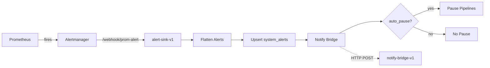

# Alerting Topology

Three independent layers; failure of any one shouldn't take the others down.

## 1. Prometheus → Alertmanager → alert-sink-v1

Standard pull-based monitoring + push-to-n8n.

- **Prometheus** scrapes its targets (currently n8n, ollama, postgres-exporter, blackbox-exporter). Config at `monitoring/prometheus.yml`. Rules at `monitoring/prometheus-rules/home-ai-alerts.yml`.
- **Alertmanager** receives firing/resolved alerts from Prometheus, deduplicates, routes. Config at `monitoring/alertmanager/config.yml`. Single route: webhook to `http://homeai-n8n:5678/webhook/prom-alert`.
- **alert-sink-v1** (n8n workflow `alert-sink-v1`) receives the webhook and:
  1. **Flatten Alerts** — explodes the `alerts: [...]` envelope, one item per alert
  2. **Upsert system_alerts + audit** — UPSERT on `fingerprint`. For resolved alerts, updates status + ends_at; for firing alerts, inserts new row or refreshes existing
  3. **Notify Bridge** — POSTs formatted message to `/webhook/notify-bridge` (U228 T1; continue-on-fail so notify-bridge failures don't block Upsert)
  4. **Auto-Pause?** — IF auto_pause === true (currently only `DeadLetterFlood`) → flips `static_context['system.state']` to `paused`



## 2. notify-bridge-v1 → Telegram (vault-dependent)

- Webhook `/webhook/notify-bridge` accepts `{"text": "..."}` (HTML).
- Fetches `bot_token` + `chat_id` from vault at `secret/data/telegram`.
- POSTs to Telegram Bot API `sendMessage`.

**Vault dependency:** if vault is sealed, this 503s. The host watchdog (layer 3) is the fallback for vault-down.

**Side-fix note (U228):** the Webhook node was missing its `webhookId` field, causing n8n to register the wrong path → 404s. Always set `webhookId` on n8n Webhook nodes.

## 3. vault-watchdog.timer → Telegram (vault-independent)

Out-of-band paging path for the case where layer 2 can't fire.

- `/home_ai/scripts/vault-watchdog.sh` runs every 5 min via systemd timer
- Reads `/home_ai/security/.vault-watchdog-creds` (root:root 0600) — Telegram bot token + chat ID stored locally
- Detects vault seal state (`unsealed` / `sealed` / `down` / `unknown`)
- Pages Telegram only on transitions (not steady-state); first-run records without paging
- Also writes current state to `vault_seal_state` table (read by `vault_status` slug for Mission Control)

## Failure-mode matrix

| Scenario | Layer 1 (Prom→AM→sink) | Layer 2 (notify-bridge) | Layer 3 (watchdog) |
|---|---|---|---|
| Vault sealed | Writes to `system_alerts` | 503 (silent) | **Pages Telegram** |
| n8n down | Alertmanager queues for retry | n/a (down with n8n) | Independent — still works |
| Postgres down | Upsert fails; rest still tries | Still works | Independent |
| Watchdog creds file missing | n/a | n/a | Exits 1 (logged in journal) |
| Telegram API down | Writes still happen | Send fails (logged) | Send fails (logged); state file not advanced — retries next tick |

## Known limitations + queued work

- **Resolved-message dedup** (U235 T3): Alertmanager's resolved messages currently UPSERT correctly when a firing row exists, but a "resolved" arriving with no prior firing row will insert a new row with `status='resolved'` — adds noise. Patched 2026-05-30 to drop resolved-with-no-existing.
- **Single route** in Alertmanager — no severity-based routing yet (all → Telegram). Multi-channel (email, on-call rotation) is a future sprint.
- **No silence/inhibition UI** — silences must be added via amtool or Prometheus rules. There's no Mission Control surface for "mute X for Y hours".
- **WatchdogN8nErrors fingerprint** previously bucketed by timestamp causing infinite row growth (fixed U228 T2). Watch for similar patterns in any new alert rules.

## Verifying the chain end-to-end

```bash
# Synthetic alert via Alertmanager-shape webhook
docker exec homeai-bot-responder python3 - <<'PY'
import json, urllib.request
payload = {
  "alerts": [{
    "status": "firing",
    "labels": {"alertname": "SyntheticTest", "severity": "info"},
    "annotations": {"summary": "U235 e2e test", "description": "Should reach Telegram"},
    "startsAt": "2026-05-30T00:00:00Z",
    "fingerprint": "synthetic-test-fp"
  }]
}
req = urllib.request.Request(
    "http://homeai-n8n:5678/webhook/prom-alert",
    data=json.dumps(payload).encode(),
    headers={"Content-Type": "application/json"},
    method="POST",
)
print(urllib.request.urlopen(req, timeout=10).status)
PY

# Then check:
# - system_alerts has a new row with fingerprint='synthetic-test-fp'
# - Telegram message arrives within a few seconds
# - Resolve by sending the same payload with status: resolved
```

See also: `feedback-alerting-circular-dep`, `feedback-watchdog-n8n-alert-accumulates`, `project-vault-recovered-2026-05-28` memories.
