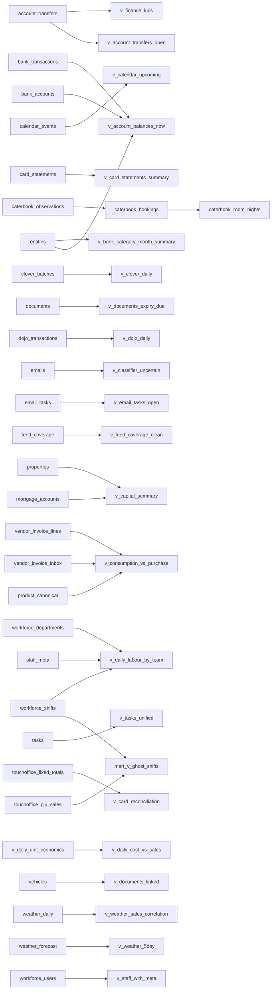

# View dependency map

Generated 2026-05-15T22:18:42+01:00. Auto-regenerated by `scripts/u89-gen-view-deps.sh`.

Total views with traceable deps: 57. Total dependency edges: 633.

## Most-referenced relations (top 30)

## Full per-view dependency list

### `mart.v_ghost_shifts`

Reads from:
- `public.touchoffice_plu_sales`
- `public.touchoffice_plu_sales`
- `public.touchoffice_plu_sales`
- `public.touchoffice_plu_sales`
- `public.workforce_shifts`

### `public.caterbook_bookings`

Reads from:
- `public.caterbook_observations`
- `public.caterbook_observations`
- `public.caterbook_observations`
- `public.caterbook_observations`
- `public.caterbook_observations`
- `public.caterbook_observations`
- `public.caterbook_observations`
- `public.caterbook_observations`
- `public.caterbook_observations`
- `public.caterbook_observations`
- `public.caterbook_observations`
- `public.caterbook_observations`

### `public.caterbook_room_nights`

Reads from:
- `public.caterbook_bookings`
- `public.caterbook_bookings`
- `public.caterbook_bookings`
- `public.caterbook_bookings`
- `public.caterbook_bookings`
- `public.caterbook_bookings`
- `public.caterbook_bookings`
- `public.caterbook_bookings`
- `public.caterbook_bookings`
- `public.caterbook_bookings`
- `public.caterbook_bookings`

### `public.v_account_balances_now`

Reads from:
- `public.bank_accounts`
- `public.bank_accounts`
- `public.bank_accounts`
- `public.bank_accounts`
- `public.bank_accounts`
- `public.bank_accounts`
- `public.bank_accounts`
- `public.bank_transactions`
- `public.bank_transactions`
- `public.bank_transactions`
- `public.bank_transactions`
- `public.bank_transactions`
- `public.entities`
- `public.entities`

### `public.v_account_transfers_open`

Reads from:
- `public.account_transfers`
- `public.account_transfers`
- `public.bank_accounts`
- `public.bank_accounts`
- `public.bank_transactions`
- `public.bank_transactions`
- `public.bank_transactions`
- `public.bank_transactions`
- `public.bank_transactions`
- `public.bank_transactions`
- `public.bank_transactions`

### `public.v_ai_calls_by_realm`

Reads from:
- `public.ai_usage`
- `public.ai_usage`
- `public.ai_usage`
- `public.ai_usage`
- `public.ai_usage`
- `public.ai_usage`
- `public.ai_usage`

### `public.v_ai_worker_drift`

Reads from:
- `public.audit_log`
- `public.audit_log`
- `public.audit_log`
- `public.audit_log`

### `public.v_bank_category_month_summary`

Reads from:
- `public.bank_transactions`
- `public.bank_transactions`
- `public.bank_transactions`
- `public.bank_transactions`
- `public.bank_transactions`
- `public.entities`
- `public.entities`

### `public.v_bank_interest_cost_summary`

Reads from:
- `public.bank_transactions`
- `public.bank_transactions`
- `public.bank_transactions`
- `public.bank_transactions`
- `public.entities`
- `public.entities`

### `public.v_bank_recurring_charges`

Reads from:
- `public.bank_accounts`
- `public.bank_accounts`
- `public.bank_transactions`
- `public.bank_transactions`
- `public.bank_transactions`
- `public.bank_transactions`
- `public.bank_transactions`
- `public.bank_transactions`

### `public.v_calendar_upcoming`

Reads from:
- `public.calendar_events`
- `public.calendar_events`
- `public.calendar_events`
- `public.calendar_events`
- `public.calendar_events`
- `public.calendar_events`
- `public.calendar_events`
- `public.calendar_events`
- `public.calendar_events`
- `public.calendar_events`
- `public.calendar_events`
- `public.calendar_events`

### `public.v_capital_summary`

Reads from:
- `public.entities`
- `public.entities`
- `public.mortgage_accounts`
- `public.mortgage_accounts`
- `public.mortgage_accounts`
- `public.properties`
- `public.properties`
- `public.properties`
- `public.properties`
- `public.properties`
- `public.properties`
- `public.properties`
- `public.property_mortgage_accounts`
- `public.property_mortgage_accounts`
- `public.property_mortgage_accounts`

### `public.v_card_fees_interest_by_month`

Reads from:
- `public.bank_accounts`
- `public.bank_accounts`
- `public.bank_accounts`
- `public.bank_accounts`
- `public.bank_accounts`
- `public.bank_transactions`
- `public.bank_transactions`
- `public.bank_transactions`
- `public.bank_transactions`

### `public.v_card_reconciliation`

Reads from:
- `public.touchoffice_fixed_totals`
- `public.touchoffice_fixed_totals`
- `public.touchoffice_fixed_totals`
- `public.touchoffice_fixed_totals`
- `public.touchoffice_fixed_totals`
- `public.v_dojo_daily`
- `public.v_dojo_daily`
- `public.v_dojo_daily`

### `public.v_card_statements_summary`

Reads from:
- `public.bank_accounts`
- `public.bank_accounts`
- `public.bank_accounts`
- `public.bank_accounts`
- `public.card_statements`
- `public.card_statements`
- `public.card_statements`
- `public.card_statements`
- `public.card_statements`
- `public.card_statements`
- `public.card_statements`
- `public.card_statements`
- `public.card_statements`
- `public.card_statements`
- `public.card_statements`
- `public.card_statements`
- `public.card_statements`
- `public.card_statements`
- `public.card_statements`
- `public.card_statements`

### `public.v_cash_variance_day`

Reads from:
- `public.till_reconciliation`
- `public.till_reconciliation`
- `public.till_reconciliation`
- `public.touchoffice_fixed_totals`
- `public.touchoffice_fixed_totals`
- `public.touchoffice_fixed_totals`

### `public.v_classifier_uncertain`

Reads from:
- `public.bot_feedback`
- `public.bot_feedback`
- `public.bot_feedback`
- `public.emails`
- `public.emails`
- `public.emails`
- `public.emails`
- `public.emails`
- `public.emails`
- `public.emails`
- `public.emails`
- `public.emails`
- `public.emails`
- `public.emails`

### `public.v_clover_daily`

Reads from:
- `public.clover_batches`
- `public.clover_batches`
- `public.clover_batches`
- `public.clover_batches`
- `public.clover_batches`
- `public.clover_batches`
- `public.clover_batches`
- `public.clover_batches`
- `public.clover_batches`

### `public.v_consumption_vs_purchase`

Reads from:
- `public.product_canonical`
- `public.product_canonical`
- `public.product_canonical`
- `public.product_canonical`
- `public.product_canonical`
- `public.recipe_components`
- `public.recipe_components`
- `public.recipe_components`
- `public.recipe_components`
- `public.recipes`
- `public.recipes`
- `public.recipes`
- `public.touchoffice_plu_sales`
- `public.touchoffice_plu_sales`
- `public.touchoffice_plu_sales`
- `public.touchoffice_plu_sales`
- `public.vendor_invoice_inbox`
- `public.vendor_invoice_inbox`
- `public.vendor_invoice_inbox`
- `public.vendor_invoice_lines`
- `public.vendor_invoice_lines`
- `public.vendor_invoice_lines`
- `public.vendor_invoice_lines`

### `public.v_daily_accom_revenue`

Reads from:
- `public.caterbook_room_nights`
- `public.caterbook_room_nights`

### `public.v_daily_cost_vs_sales`

Reads from:
- `public.v_daily_unit_economics`
- `public.v_daily_unit_economics`
- `public.v_daily_unit_economics`
- `public.v_daily_unit_economics`
- `public.v_daily_unit_economics`
- `public.vendor_invoice_inbox`
- `public.vendor_invoice_inbox`
- `public.vendor_invoice_inbox`
- `public.vendor_invoice_inbox`
- `public.vendor_invoice_inbox`
- `public.vendor_invoice_inbox`
- `public.vendor_invoice_inbox`
- `public.vendor_invoice_inbox`

### `public.v_daily_gp`

Reads from:
- `public.v_daily_unit_economics`
- `public.v_daily_unit_economics`
- `public.v_daily_unit_economics`
- `public.v_daily_unit_economics`
- `public.v_daily_unit_economics`
- `public.vendor_invoice_inbox`
- `public.vendor_invoice_inbox`
- `public.vendor_invoice_inbox`
- `public.vendor_invoice_inbox`
- `public.vendor_invoice_inbox`
- `public.vendor_invoice_inbox`
- `public.vendor_invoice_inbox`

### `public.v_daily_labour_by_team`

Reads from:
- `public.staff_meta`
- `public.staff_meta`
- `public.staff_meta`
- `public.workforce_departments`
- `public.workforce_departments`
- `public.workforce_departments`
- `public.workforce_shifts`
- `public.workforce_shifts`
- `public.workforce_shifts`
- `public.workforce_shifts`

### `public.v_daily_spend`

Reads from:
- `public.vendor_invoice_inbox`
- `public.vendor_invoice_inbox`
- `public.vendor_invoice_inbox`
- `public.vendor_invoice_inbox`
- `public.vendor_invoice_inbox`

### `public.v_daily_unit_economics`

Reads from:
- `public.caterbook_daily_snapshots`
- `public.caterbook_daily_snapshots`
- `public.staff_meta`
- `public.staff_meta`
- `public.staff_meta`
- `public.touchoffice_fixed_totals`
- `public.touchoffice_fixed_totals`
- `public.touchoffice_fixed_totals`
- `public.touchoffice_fixed_totals`
- `public.touchoffice_fixed_totals`
- `public.v_daily_accom_revenue`
- `public.v_daily_accom_revenue`
- `public.v_daily_accom_revenue`
- `public.workforce_departments`
- `public.workforce_departments`
- `public.workforce_shifts`
- `public.workforce_shifts`
- `public.workforce_shifts`
- `public.workforce_shifts`

### `public.v_documents_expiry_due`

Reads from:
- `public.documents`
- `public.documents`
- `public.documents`
- `public.documents`
- `public.documents`
- `public.documents`
- `public.documents`
- `public.documents`
- `public.documents`

### `public.v_documents_linked`

Reads from:
- `public.children`
- `public.children`
- `public.documents`
- `public.documents`
- `public.documents`
- `public.documents`
- `public.documents`
- `public.documents`
- `public.documents`
- `public.documents`
- `public.documents`
- `public.documents`
- `public.documents`
- `public.properties`
- `public.properties`
- `public.vehicles`
- `public.vehicles`
- `public.vehicles`

### `public.v_dojo_daily`

Reads from:
- `public.dojo_transactions`
- `public.dojo_transactions`
- `public.dojo_transactions`
- `public.dojo_transactions`
- `public.dojo_transactions`
- `public.dojo_transactions`
- `public.dojo_transactions`
- `public.dojo_transactions`
- `public.dojo_transactions`

### `public.v_email_tasks_open`

Reads from:
- `public.email_tasks`
- `public.email_tasks`
- `public.email_tasks`
- `public.email_tasks`
- `public.email_tasks`
- `public.email_tasks`
- `public.email_tasks`
- `public.email_tasks`
- `public.email_tasks`
- `public.emails`
- `public.emails`
- `public.emails`
- `public.emails`

### `public.v_feed_coverage_clean`

Reads from:
- `public.business_calendar`
- `public.business_calendar`
- `public.business_calendar`
- `public.feed_coverage`
- `public.feed_coverage`
- `public.feed_coverage`
- `public.feed_coverage`
- `public.feed_coverage`
- `public.feed_coverage`
- `public.feed_coverage`
- `public.feed_coverage`
- `public.feed_coverage`

### `public.v_feed_coverage_recent_gaps`

Reads from:
- `public.feed_coverage`
- `public.feed_coverage`
- `public.feed_coverage`
- `public.feed_coverage`
- `public.feed_coverage`

### `public.v_feed_coverage_summary`

Reads from:
- `public.feed_coverage`
- `public.feed_coverage`
- `public.feed_coverage`
- `public.feed_coverage`

### `public.v_feed_coverage_summary_clean`

Reads from:
- `public.v_feed_coverage_clean`
- `public.v_feed_coverage_clean`

### `public.v_finance_kpis`

Reads from:
- `public.account_transfers`
- `public.bank_accounts`
- `public.bank_accounts`
- `public.bank_transactions`
- `public.bank_transactions`
- `public.bank_transactions`
- `public.bank_transactions`
- `public.v_account_balances_now`
- `public.v_account_balances_now`
- `public.v_account_transfers_open`
- `public.v_finance_monthly_summary`
- `public.v_finance_monthly_summary`

### `public.v_finance_monthly_summary`

Reads from:
- `public.bank_accounts`
- `public.bank_accounts`
- `public.bank_accounts`
- `public.bank_accounts`
- `public.bank_transactions`
- `public.bank_transactions`
- `public.bank_transactions`
- `public.bank_transactions`
- `public.entities`
- `public.entities`

### `public.v_finance_recent_unified`

Reads from:
- `public.bank_accounts`
- `public.bank_accounts`
- `public.bank_accounts`
- `public.bank_transactions`
- `public.bank_transactions`
- `public.bank_transactions`
- `public.bank_transactions`
- `public.bank_transactions`
- `public.bank_transactions`
- `public.bank_transactions`
- `public.bank_transactions`
- `public.dojo_transactions`
- `public.dojo_transactions`
- `public.dojo_transactions`
- `public.dojo_transactions`
- `public.dojo_transactions`
- `public.vendor_invoice_inbox`
- `public.vendor_invoice_inbox`
- `public.vendor_invoice_inbox`
- `public.vendor_invoice_inbox`
- `public.vendor_invoice_inbox`
- `public.vendor_invoice_inbox`
- `public.vendor_invoice_inbox`
- `public.vendor_invoice_inbox`

### `public.v_inter_entity_owings`

Reads from:
- `public.account_transfers`
- `public.account_transfers`
- `public.account_transfers`
- `public.account_transfers`
- `public.account_transfers`
- `public.bank_transactions`
- `public.bank_transactions`
- `public.entities`
- `public.entities`

### `public.v_invoice_lines_resolved`

Reads from:
- `public.product_canonical`
- `public.product_canonical`
- `public.product_canonical`
- `public.vendor_invoice_inbox`
- `public.vendor_invoice_inbox`
- `public.vendor_invoice_inbox`
- `public.vendor_invoice_inbox`
- `public.vendor_invoice_inbox`
- `public.vendor_invoice_inbox`
- `public.vendor_invoice_inbox`
- `public.vendor_invoice_lines`
- `public.vendor_invoice_lines`
- `public.vendor_invoice_lines`
- `public.vendor_invoice_lines`
- `public.vendor_invoice_lines`
- `public.vendor_invoice_lines`
- `public.vendor_invoice_lines`
- `public.vendor_invoice_lines`
- `public.vendor_invoice_lines`
- `public.vendor_invoice_lines`
- `public.vendor_invoice_lines`
- `public.vendor_invoice_lines`
- `public.vendor_invoice_lines`

### `public.v_kpi_anomalies`

Reads from:
- `public.v_daily_unit_economics`
- `public.v_daily_unit_economics`
- `public.v_daily_unit_economics`
- `public.v_daily_unit_economics`
- `public.v_daily_unit_economics`
- `public.v_daily_unit_economics`

### `public.v_live_ops_kpis`

Reads from:
- `public.caterbook_daily_snapshots`
- `public.caterbook_daily_snapshots`
- `public.caterbook_daily_snapshots`
- `public.caterbook_daily_snapshots`
- `public.ops_constants`
- `public.ops_constants`
- `public.ops_thresholds`
- `public.ops_thresholds`
- `public.ops_thresholds`
- `public.v_daily_unit_economics`
- `public.v_daily_unit_economics`
- `public.v_daily_unit_economics`
- `public.v_daily_unit_economics`
- `public.v_daily_unit_economics`
- `public.v_daily_unit_economics`
- `public.v_daily_unit_economics`
- `public.v_daily_unit_economics`
- `public.v_daily_unit_economics`

### `public.v_mortgage_coverage`

Reads from:
- `public.mortgage_accounts`
- `public.mortgage_accounts`
- `public.mortgage_accounts`
- `public.mortgage_accounts`
- `public.mortgage_statement_periods`
- `public.mortgage_statement_periods`

### `public.v_mortgage_summary`

Reads from:
- `public.documents`
- `public.documents`
- `public.entities`
- `public.entities`
- `public.mortgage_accounts`
- `public.mortgage_accounts`
- `public.mortgage_accounts`
- `public.mortgage_accounts`
- `public.mortgage_accounts`
- `public.mortgage_accounts`
- `public.mortgage_accounts`
- `public.mortgage_accounts`
- `public.mortgage_accounts`
- `public.mortgage_accounts`
- `public.mortgage_accounts`
- `public.properties`
- `public.properties`
- `public.property_mortgage_accounts`
- `public.property_mortgage_accounts`
- `public.property_mortgage_accounts`

### `public.v_net_worth_summary`

Reads from:
- `public.mortgage_accounts`
- `public.mortgage_accounts`
- `public.properties`
- `public.v_account_balances_now`
- `public.v_account_balances_now`

### `public.v_product_purchases`

Reads from:
- `public.product_canonical`
- `public.product_canonical`
- `public.product_canonical`
- `public.product_canonical`
- `public.vendor_invoice_inbox`
- `public.vendor_invoice_inbox`
- `public.vendor_invoice_inbox`
- `public.vendor_invoice_inbox`
- `public.vendor_invoice_inbox`
- `public.vendor_invoice_inbox`
- `public.vendor_invoice_inbox`
- `public.vendor_invoice_inbox`
- `public.vendor_invoice_inbox`
- `public.vendor_invoice_lines`
- `public.vendor_invoice_lines`
- `public.vendor_invoice_lines`
- `public.vendor_invoice_lines`
- `public.vendor_invoice_lines`
- `public.vendor_invoice_lines`
- `public.vendor_invoice_lines`
- `public.vendor_invoice_lines`
- `public.vendor_invoice_lines`
- `public.vendor_invoice_lines`
- `public.vendor_invoice_lines`

### `public.v_property_comparable_summary`

Reads from:
- `public.properties`
- `public.properties`
- `public.properties`
- `public.properties`
- `public.properties`
- `public.properties`
- `public.property_market_log`
- `public.property_market_log`
- `public.property_market_log`
- `public.property_market_log`

### `public.v_realm_audit_violations`

Reads from:
- `public.bank_transactions`
- `public.bank_transactions`
- `public.bank_transactions`
- `public.documents`
- `public.documents`
- `public.documents`
- `public.invoices`
- `public.invoices`
- `public.invoices`
- `public.vendor_invoice_inbox`
- `public.vendor_invoice_inbox`
- `public.vendor_invoice_inbox`

### `public.v_research_corpus`

Reads from:
- `public.documents`
- `public.documents`
- `public.documents`
- `public.documents`
- `public.documents`
- `public.documents`
- `public.documents`
- `public.emails`
- `public.emails`
- `public.emails`
- `public.emails`
- `public.emails`
- `public.emails`
- `public.emails`
- `public.emails`
- `public.vendor_invoice_inbox`
- `public.vendor_invoice_inbox`
- `public.vendor_invoice_inbox`
- `public.vendor_invoice_inbox`
- `public.vendor_invoice_inbox`
- `public.vendor_invoice_lines`
- `public.vendor_invoice_lines`
- `public.vendor_invoice_lines`
- `public.vendor_invoice_lines`

### `public.v_staff_with_meta`

Reads from:
- `public.staff_meta`
- `public.staff_meta`
- `public.staff_meta`
- `public.staff_meta`
- `public.staff_meta`
- `public.staff_meta`
- `public.staff_meta`
- `public.workforce_users`
- `public.workforce_users`
- `public.workforce_users`
- `public.workforce_users`
- `public.workforce_users`
- `public.workforce_users`

### `public.v_tasks_unified`

Reads from:
- `public.email_tasks`
- `public.email_tasks`
- `public.email_tasks`
- `public.email_tasks`
- `public.email_tasks`
- `public.email_tasks`
- `public.email_tasks`
- `public.email_tasks`
- `public.tasks`
- `public.tasks`
- `public.tasks`
- `public.tasks`
- `public.tasks`
- `public.tasks`
- `public.tasks`
- `public.tasks`
- `public.tasks`
- `public.tasks`

### `public.v_top_vendors_window`

Reads from:
- `public.vendor_invoice_inbox`
- `public.vendor_invoice_inbox`
- `public.vendor_invoice_inbox`
- `public.vendor_invoice_inbox`
- `public.vendor_invoice_inbox`

### `public.v_uncategorised_summary`

Reads from:
- `public.bank_accounts`
- `public.bank_accounts`
- `public.bank_transactions`
- `public.bank_transactions`
- `public.bank_transactions`
- `public.bank_transactions`
- `public.bank_transactions`

### `public.v_vehicle_alerts`

Reads from:
- `public.vehicles`
- `public.vehicles`
- `public.vehicles`
- `public.vehicles`
- `public.vehicles`
- `public.vehicles`
- `public.vehicles`
- `public.vehicles`

### `public.v_weather_5day`

Reads from:
- `public.weather_forecast`
- `public.weather_forecast`
- `public.weather_forecast`
- `public.weather_forecast`
- `public.weather_forecast`
- `public.weather_forecast`
- `public.weather_forecast`

### `public.v_weather_sales_correlation`

Reads from:
- `public.v_daily_unit_economics`
- `public.v_daily_unit_economics`
- `public.v_daily_unit_economics`
- `public.v_daily_unit_economics`
- `public.v_daily_unit_economics`
- `public.weather_daily`
- `public.weather_daily`
- `public.weather_daily`
- `public.weather_daily`
- `public.weather_daily`

### `public.v_weather_seasonality`

Reads from:
- `public.weather_daily`
- `public.weather_daily`
- `public.weather_daily`
- `public.weather_daily`
- `public.weather_daily`
- `public.weather_daily`

### `public.v_weekly_spend`

Reads from:
- `public.vendor_invoice_inbox`
- `public.vendor_invoice_inbox`
- `public.vendor_invoice_inbox`
- `public.vendor_invoice_inbox`

### `public.v_workforce_shifts_costed`

Reads from:
- `public.staff_meta`
- `public.staff_meta`
- `public.staff_meta`
- `public.workforce_departments`
- `public.workforce_departments`
- `public.workforce_shifts`
- `public.workforce_shifts`
- `public.workforce_shifts`
- `public.workforce_shifts`
- `public.workforce_shifts`
- `public.workforce_shifts`
- `public.workforce_shifts`
- `public.workforce_shifts`
- `public.workforce_shifts`
- `public.workforce_users`
- `public.workforce_users`
- `public.workforce_users`
- `public.workforce_users`
