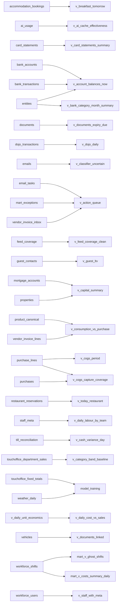

# View dependency map

Generated 2026-07-05T09:58:12+01:00. Auto-regenerated by `scripts/u89-gen-view-deps.sh`.

Total views with traceable deps: 111. Total dependency edges: 1250.

## Most-referenced relations (top 30)

## Full per-view dependency list

### `mart.v_costs_summary_daily`

Reads from:
- `public.v_daily_cost_vs_sales`
- `public.v_daily_cost_vs_sales`
- `public.v_daily_cost_vs_sales`
- `public.v_daily_cost_vs_sales`
- `public.v_daily_cost_vs_sales`
- `public.v_daily_cost_vs_sales`
- `public.v_daily_cost_vs_sales`
- `public.v_daily_cost_vs_sales`
- `public.v_daily_cost_vs_sales`
- `public.workforce_shifts`
- `public.workforce_shifts`

### `mart.v_ghost_shifts`

Reads from:
- `public.touchoffice_plu_sales`
- `public.touchoffice_plu_sales`
- `public.touchoffice_plu_sales`
- `public.touchoffice_plu_sales`
- `public.workforce_shifts`

### `public.caterbook_bookings`

Reads from:
- `public.caterbook_observations`
- `public.caterbook_observations`
- `public.caterbook_observations`
- `public.caterbook_observations`
- `public.caterbook_observations`
- `public.caterbook_observations`
- `public.caterbook_observations`
- `public.caterbook_observations`
- `public.caterbook_observations`
- `public.caterbook_observations`
- `public.caterbook_observations`
- `public.caterbook_observations`

### `public.caterbook_room_nights`

Reads from:
- `public.caterbook_bookings`
- `public.caterbook_bookings`
- `public.caterbook_bookings`
- `public.caterbook_bookings`
- `public.caterbook_bookings`
- `public.caterbook_bookings`
- `public.caterbook_bookings`
- `public.caterbook_bookings`
- `public.caterbook_bookings`
- `public.caterbook_bookings`
- `public.caterbook_bookings`

### `public.model_training`

Reads from:
- `public.holiday_markers`
- `public.holiday_markers`
- `public.holiday_markers`
- `public.inflation_monthly`
- `public.inflation_monthly`
- `public.inflation_monthly`
- `public.inflation_monthly`
- `public.tide_daily`
- `public.tide_daily`
- `public.tide_daily`
- `public.tide_daily`
- `public.tide_daily`
- `public.tide_daily`
- `public.tide_daily`
- `public.tide_daily`
- `public.tide_daily`
- `public.touchoffice_fixed_totals`
- `public.touchoffice_fixed_totals`
- `public.touchoffice_fixed_totals`
- `public.touchoffice_fixed_totals`
- `public.touchoffice_fixed_totals`
- `public.weather_daily`
- `public.weather_daily`
- `public.weather_daily`
- `public.weather_daily`
- `public.weather_daily`
- `public.weather_daily`
- `public.weather_daily`
- `public.weather_daily`

### `public.v_account_balances_now`

Reads from:
- `public.bank_accounts`
- `public.bank_accounts`
- `public.bank_accounts`
- `public.bank_accounts`
- `public.bank_accounts`
- `public.bank_accounts`
- `public.bank_accounts`
- `public.bank_transactions`
- `public.bank_transactions`
- `public.bank_transactions`
- `public.bank_transactions`
- `public.bank_transactions`
- `public.entities`
- `public.entities`

### `public.v_account_transfers_open`

Reads from:
- `public.account_transfers`
- `public.account_transfers`
- `public.bank_accounts`
- `public.bank_accounts`
- `public.bank_category_registry`
- `public.bank_category_registry`
- `public.bank_transactions`
- `public.bank_transactions`
- `public.bank_transactions`
- `public.bank_transactions`
- `public.bank_transactions`
- `public.bank_transactions`
- `public.bank_transactions`

### `public.v_action_queue`

Reads from:
- `mart.exceptions`
- `mart.exceptions`
- `mart.exceptions`
- `mart.exceptions`
- `mart.exceptions`
- `mart.exceptions`
- `mart.exceptions`
- `mart.exceptions`
- `mart.exceptions`
- `public.bot_instructions`
- `public.bot_instructions`
- `public.bot_instructions`
- `public.bot_instructions`
- `public.bot_instructions`
- `public.bot_instructions`
- `public.email_tasks`
- `public.email_tasks`
- `public.email_tasks`
- `public.email_tasks`
- `public.email_tasks`
- `public.email_tasks`
- `public.email_tasks`
- `public.email_tasks`
- `public.email_tasks`
- `public.v_documents_expiry_due`
- `public.v_documents_expiry_due`
- `public.v_documents_expiry_due`
- `public.v_documents_expiry_due`
- `public.v_documents_expiry_due`
- `public.v_vehicle_alerts`
- `public.v_vehicle_alerts`
- `public.v_vehicle_alerts`
- `public.v_vehicle_alerts`
- `public.v_vehicle_alerts`
- `public.v_vehicle_alerts`
- `public.v_vehicle_alerts`
- `public.v_vehicle_alerts`
- `public.vendor_invoice_inbox`
- `public.vendor_invoice_inbox`
- `public.vendor_invoice_inbox`
- `public.vendor_invoice_inbox`
- `public.vendor_invoice_inbox`
- `public.vendor_invoice_inbox`
- `public.vendor_invoice_inbox`

### `public.v_action_queue_stratified`

Reads from:
- `public.v_action_queue`
- `public.v_action_queue`
- `public.v_action_queue`
- `public.v_action_queue`
- `public.v_action_queue`
- `public.v_action_queue`
- `public.v_action_queue`
- `public.v_action_queue`
- `public.v_action_queue`

### `public.v_ai_cache_effectiveness`

Reads from:
- `public.ai_usage`
- `public.ai_usage`
- `public.ai_usage`
- `public.ai_usage`
- `public.ai_usage`
- `public.ai_usage`

### `public.v_ai_calls_by_realm`

Reads from:
- `public.ai_usage`
- `public.ai_usage`
- `public.ai_usage`
- `public.ai_usage`
- `public.ai_usage`
- `public.ai_usage`
- `public.ai_usage`

### `public.v_ai_spend_7d`

Reads from:
- `public.ai_usage`
- `public.ai_usage`
- `public.ai_usage`

### `public.v_ai_spend_7d_by_capability`

Reads from:
- `public.ai_usage`
- `public.ai_usage`
- `public.ai_usage`
- `public.ai_usage`
- `public.ai_usage`

### `public.v_ai_spend_today`

Reads from:
- `public.ai_usage`
- `public.ai_usage`
- `public.ai_usage`
- `public.ai_usage`

### `public.v_ai_worker_drift`

Reads from:
- `public.audit_log`
- `public.audit_log`
- `public.audit_log`
- `public.audit_log`

### `public.v_bank_category_month_summary`

Reads from:
- `public.bank_transactions`
- `public.bank_transactions`
- `public.bank_transactions`
- `public.bank_transactions`
- `public.bank_transactions`
- `public.entities`
- `public.entities`

### `public.v_bank_interest_cost_summary`

Reads from:
- `public.bank_transactions`
- `public.bank_transactions`
- `public.bank_transactions`
- `public.bank_transactions`
- `public.entities`
- `public.entities`

### `public.v_bank_recurring_charges`

Reads from:
- `public.bank_accounts`
- `public.bank_accounts`
- `public.bank_transactions`
- `public.bank_transactions`
- `public.bank_transactions`
- `public.bank_transactions`
- `public.bank_transactions`
- `public.bank_transactions`

### `public.v_breakfast_tomorrow`

Reads from:
- `public.accommodation_bookings`
- `public.accommodation_bookings`
- `public.accommodation_bookings`
- `public.accommodation_bookings`
- `public.accommodation_bookings`
- `public.accommodation_bookings`
- `public.breakfast_orders`
- `public.breakfast_orders`
- `public.breakfast_orders`
- `public.breakfast_orders`
- `public.breakfast_orders`
- `public.breakfast_orders`
- `public.breakfast_orders`
- `public.breakfast_orders`

### `public.v_build_forensic_summary`

Reads from:
- `mart.exceptions`
- `mart.exceptions`
- `mart.exceptions`
- `mart.exceptions`
- `public.v_classifier_uncertain`
- `public.v_kpi_anomalies`

### `public.v_build_model_spend_30d`

Reads from:
- `public.ai_usage`
- `public.ai_usage`
- `public.ai_usage`
- `public.ai_usage`
- `public.ai_usage`
- `public.ai_usage`

### `public.v_build_pipeline_status`

Reads from:
- `public.ai_usage`
- `public.ai_usage`

### `public.v_calendar_upcoming`

Reads from:
- `public.calendar_events`
- `public.calendar_events`
- `public.calendar_events`
- `public.calendar_events`
- `public.calendar_events`
- `public.calendar_events`
- `public.calendar_events`
- `public.calendar_events`
- `public.calendar_events`
- `public.calendar_events`
- `public.calendar_events`
- `public.calendar_events`

### `public.v_capital_summary`

Reads from:
- `public.entities`
- `public.entities`
- `public.mortgage_accounts`
- `public.mortgage_accounts`
- `public.mortgage_accounts`
- `public.properties`
- `public.properties`
- `public.properties`
- `public.properties`
- `public.properties`
- `public.properties`
- `public.properties`
- `public.property_mortgage_accounts`
- `public.property_mortgage_accounts`
- `public.property_mortgage_accounts`

### `public.v_card_fees_interest_by_month`

Reads from:
- `public.bank_accounts`
- `public.bank_accounts`
- `public.bank_accounts`
- `public.bank_accounts`
- `public.bank_accounts`
- `public.bank_transactions`
- `public.bank_transactions`
- `public.bank_transactions`
- `public.bank_transactions`

### `public.v_card_reconciliation`

Reads from:
- `public.touchoffice_fixed_totals`
- `public.touchoffice_fixed_totals`
- `public.touchoffice_fixed_totals`
- `public.touchoffice_fixed_totals`
- `public.touchoffice_fixed_totals`
- `public.v_dojo_daily`
- `public.v_dojo_daily`
- `public.v_dojo_daily`

### `public.v_card_statements_summary`

Reads from:
- `public.bank_accounts`
- `public.bank_accounts`
- `public.bank_accounts`
- `public.bank_accounts`
- `public.card_statements`
- `public.card_statements`
- `public.card_statements`
- `public.card_statements`
- `public.card_statements`
- `public.card_statements`
- `public.card_statements`
- `public.card_statements`
- `public.card_statements`
- `public.card_statements`
- `public.card_statements`
- `public.card_statements`
- `public.card_statements`
- `public.card_statements`
- `public.card_statements`
- `public.card_statements`

### `public.v_cash_variance_day`

Reads from:
- `public.till_reconciliation`
- `public.till_reconciliation`
- `public.till_reconciliation`
- `public.touchoffice_fixed_totals`
- `public.touchoffice_fixed_totals`
- `public.touchoffice_fixed_totals`

### `public.v_category_band_baseline`

Reads from:
- `public.touchoffice_department_sales`
- `public.touchoffice_department_sales`
- `public.touchoffice_department_sales`
- `public.touchoffice_department_sales`
- `public.weather_daily`
- `public.weather_daily`
- `public.weather_daily`

### `public.v_classifier_uncertain`

Reads from:
- `public.bot_feedback`
- `public.bot_feedback`
- `public.bot_feedback`
- `public.emails`
- `public.emails`
- `public.emails`
- `public.emails`
- `public.emails`
- `public.emails`
- `public.emails`
- `public.emails`
- `public.emails`
- `public.emails`
- `public.emails`

### `public.v_clover_daily`

Reads from:
- `public.clover_batches`
- `public.clover_batches`
- `public.clover_batches`
- `public.clover_batches`
- `public.clover_batches`
- `public.clover_batches`
- `public.clover_batches`
- `public.clover_batches`
- `public.clover_batches`

### `public.v_cogs_capture_coverage`

Reads from:
- `public.purchase_lines`
- `public.purchase_lines`
- `public.purchases`
- `public.purchases`
- `public.purchases`
- `public.purchases`
- `public.purchases`
- `public.purchases`

### `public.v_cogs_period`

Reads from:
- `public.cogs_category_map`
- `public.cogs_category_map`
- `public.cogs_category_map`
- `public.cogs_category_map`
- `public.purchase_lines`
- `public.purchase_lines`
- `public.purchase_lines`
- `public.purchases`
- `public.purchases`
- `public.purchases`
- `public.purchases`
- `public.purchases`
- `public.purchases`

### `public.v_consumption_vs_purchase`

Reads from:
- `public.product_canonical`
- `public.product_canonical`
- `public.product_canonical`
- `public.product_canonical`
- `public.product_canonical`
- `public.recipe_components`
- `public.recipe_components`
- `public.recipe_components`
- `public.recipe_components`
- `public.recipes`
- `public.recipes`
- `public.recipes`
- `public.touchoffice_plu_sales`
- `public.touchoffice_plu_sales`
- `public.touchoffice_plu_sales`
- `public.touchoffice_plu_sales`
- `public.vendor_invoice_inbox`
- `public.vendor_invoice_inbox`
- `public.vendor_invoice_inbox`
- `public.vendor_invoice_lines`
- `public.vendor_invoice_lines`
- `public.vendor_invoice_lines`
- `public.vendor_invoice_lines`

### `public.v_daily_accom_revenue`

Reads from:
- `public.caterbook_room_nights`
- `public.caterbook_room_nights`

### `public.v_daily_cost_vs_sales`

Reads from:
- `public.v_daily_unit_economics`
- `public.v_daily_unit_economics`
- `public.v_daily_unit_economics`
- `public.v_daily_unit_economics`
- `public.v_daily_unit_economics`
- `public.vendor_invoice_inbox`
- `public.vendor_invoice_inbox`
- `public.vendor_invoice_inbox`
- `public.vendor_invoice_inbox`
- `public.vendor_invoice_inbox`
- `public.vendor_invoice_inbox`
- `public.vendor_invoice_inbox`
- `public.vendor_invoice_inbox`

### `public.v_daily_gp`

Reads from:
- `public.v_daily_unit_economics`
- `public.v_daily_unit_economics`
- `public.v_daily_unit_economics`
- `public.v_daily_unit_economics`
- `public.v_daily_unit_economics`
- `public.v_pub_sales_mix`
- `public.v_pub_sales_mix`
- `public.v_pub_sales_mix`
- `public.vendor_invoice_inbox`
- `public.vendor_invoice_inbox`
- `public.vendor_invoice_inbox`
- `public.vendor_invoice_inbox`
- `public.vendor_invoice_inbox`
- `public.vendor_invoice_inbox`

### `public.v_daily_labour_by_team`

Reads from:
- `public.staff_meta`
- `public.staff_meta`
- `public.staff_meta`
- `public.workforce_departments`
- `public.workforce_departments`
- `public.workforce_departments`
- `public.workforce_shifts`
- `public.workforce_shifts`
- `public.workforce_shifts`
- `public.workforce_shifts`
- `public.workforce_shifts`

### `public.v_daily_spend`

Reads from:
- `public.vendor_invoice_inbox`
- `public.vendor_invoice_inbox`
- `public.vendor_invoice_inbox`
- `public.vendor_invoice_inbox`
- `public.vendor_invoice_inbox`

### `public.v_daily_unit_economics`

Reads from:
- `public.caterbook_daily_snapshots`
- `public.caterbook_daily_snapshots`
- `public.staff_meta`
- `public.staff_meta`
- `public.staff_meta`
- `public.touchoffice_department_sales`
- `public.touchoffice_department_sales`
- `public.touchoffice_department_sales`
- `public.touchoffice_fixed_totals`
- `public.touchoffice_fixed_totals`
- `public.touchoffice_fixed_totals`
- `public.touchoffice_fixed_totals`
- `public.touchoffice_fixed_totals`
- `public.v_daily_accom_revenue`
- `public.v_daily_accom_revenue`
- `public.v_daily_accom_revenue`
- `public.workforce_departments`
- `public.workforce_departments`
- `public.workforce_shifts`
- `public.workforce_shifts`
- `public.workforce_shifts`
- `public.workforce_shifts`
- `public.workforce_shifts`

### `public.v_documents_expiry_due`

Reads from:
- `public.documents`
- `public.documents`
- `public.documents`
- `public.documents`
- `public.documents`
- `public.documents`
- `public.documents`
- `public.documents`
- `public.documents`

### `public.v_documents_linked`

Reads from:
- `public.children`
- `public.children`
- `public.documents`
- `public.documents`
- `public.documents`
- `public.documents`
- `public.documents`
- `public.documents`
- `public.documents`
- `public.documents`
- `public.documents`
- `public.documents`
- `public.documents`
- `public.properties`
- `public.properties`
- `public.vehicles`
- `public.vehicles`
- `public.vehicles`

### `public.v_documents_needing_review`

Reads from:
- `public.documents`
- `public.documents`
- `public.documents`
- `public.documents`
- `public.documents`
- `public.documents`
- `public.documents`
- `public.documents`
- `public.documents`
- `public.documents`
- `public.documents_classification_queue`
- `public.documents_classification_queue`
- `public.documents_classification_queue`
- `public.documents_classification_queue`
- `public.documents_classification_queue`
- `public.documents_classification_queue`
- `public.documents_classification_queue`
- `public.documents_classification_queue`
- `public.documents_classification_queue`
- `public.documents_classification_queue`

### `public.v_dojo_daily`

Reads from:
- `public.dojo_transactions`
- `public.dojo_transactions`
- `public.dojo_transactions`
- `public.dojo_transactions`
- `public.dojo_transactions`
- `public.dojo_transactions`
- `public.dojo_transactions`
- `public.dojo_transactions`
- `public.dojo_transactions`

### `public.v_dojo_freshness`

Reads from:
- `public.dojo_transactions`

### `public.v_drinks_spend`

Reads from:
- `public.vendor_invoice_inbox`
- `public.vendor_invoice_inbox`
- `public.vendor_invoice_inbox`
- `public.vendor_invoice_inbox`
- `public.vendor_invoice_inbox`
- `public.vendor_invoice_lines`
- `public.vendor_invoice_lines`
- `public.vendor_invoice_lines`

### `public.v_email_tasks_open`

Reads from:
- `public.email_tasks`
- `public.email_tasks`
- `public.email_tasks`
- `public.email_tasks`
- `public.email_tasks`
- `public.email_tasks`
- `public.email_tasks`
- `public.email_tasks`
- `public.email_tasks`
- `public.emails`
- `public.emails`
- `public.emails`
- `public.emails`

### `public.v_feed_coverage_clean`

Reads from:
- `public.business_calendar`
- `public.business_calendar`
- `public.business_calendar`
- `public.feed_coverage`
- `public.feed_coverage`
- `public.feed_coverage`
- `public.feed_coverage`
- `public.feed_coverage`
- `public.feed_coverage`
- `public.feed_coverage`
- `public.feed_coverage`
- `public.feed_coverage`

### `public.v_feed_coverage_recent_gaps`

Reads from:
- `public.feed_coverage`
- `public.feed_coverage`
- `public.feed_coverage`
- `public.feed_coverage`
- `public.feed_coverage`

### `public.v_feed_coverage_summary`

Reads from:
- `public.feed_coverage`
- `public.feed_coverage`
- `public.feed_coverage`
- `public.feed_coverage`

### `public.v_feed_coverage_summary_clean`

Reads from:
- `public.v_feed_coverage_clean`
- `public.v_feed_coverage_clean`

### `public.v_finance_kpis`

Reads from:
- `public.account_transfers`
- `public.bank_accounts`
- `public.bank_accounts`
- `public.bank_transactions`
- `public.bank_transactions`
- `public.bank_transactions`
- `public.bank_transactions`
- `public.v_account_balances_now`
- `public.v_account_balances_now`
- `public.v_account_transfers_open`
- `public.v_finance_monthly_summary`
- `public.v_finance_monthly_summary`

### `public.v_finance_monthly_summary`

Reads from:
- `public.bank_accounts`
- `public.bank_accounts`
- `public.bank_accounts`
- `public.bank_accounts`
- `public.bank_transactions`
- `public.bank_transactions`
- `public.bank_transactions`
- `public.bank_transactions`
- `public.entities`
- `public.entities`

### `public.v_finance_recent_unified`

Reads from:
- `public.bank_accounts`
- `public.bank_accounts`
- `public.bank_accounts`
- `public.bank_transactions`
- `public.bank_transactions`
- `public.bank_transactions`
- `public.bank_transactions`
- `public.bank_transactions`
- `public.bank_transactions`
- `public.bank_transactions`
- `public.bank_transactions`
- `public.dojo_transactions`
- `public.dojo_transactions`
- `public.dojo_transactions`
- `public.dojo_transactions`
- `public.dojo_transactions`
- `public.vendor_invoice_inbox`
- `public.vendor_invoice_inbox`
- `public.vendor_invoice_inbox`
- `public.vendor_invoice_inbox`
- `public.vendor_invoice_inbox`
- `public.vendor_invoice_inbox`
- `public.vendor_invoice_inbox`
- `public.vendor_invoice_inbox`

### `public.v_gross_margin_period`

Reads from:
- `public.touchoffice_department_sales`
- `public.touchoffice_department_sales`
- `public.touchoffice_department_sales`
- `public.v_cogs_period`
- `public.v_cogs_period`
- `public.v_cogs_period`
- `public.v_cogs_period`

### `public.v_guest_ltv`

Reads from:
- `public.guest_contacts`
- `public.guest_contacts`
- `public.guest_contacts`
- `public.guest_contacts`
- `public.guest_contacts`
- `public.guest_contacts`
- `public.guest_contacts`
- `public.guest_contacts`
- `public.guest_contacts`
- `public.guest_contacts`

### `public.v_inter_entity_owings`

Reads from:
- `public.account_transfers`
- `public.account_transfers`
- `public.account_transfers`
- `public.account_transfers`
- `public.account_transfers`
- `public.bank_transactions`
- `public.bank_transactions`
- `public.entities`
- `public.entities`

### `public.v_invoice_categorised`

Reads from:
- `public.vendor_invoice_inbox`
- `public.vendor_invoice_inbox`
- `public.vendor_invoice_inbox`
- `public.vendor_invoice_inbox`
- `public.vendor_invoice_inbox`
- `public.vendor_invoice_inbox`
- `public.vendor_invoice_inbox`
- `public.vendor_invoice_inbox`
- `public.vendor_invoice_inbox`
- `public.vendor_invoice_inbox`
- `public.vendor_invoice_inbox`
- `public.vendor_invoice_inbox`
- `public.vendor_invoice_inbox`
- `public.vendor_invoice_inbox`
- `public.vendor_invoice_inbox`
- `public.vendor_invoice_inbox`
- `public.vendor_invoice_inbox`
- `public.vendor_invoice_inbox`
- `public.vendor_invoice_inbox`
- `public.vendor_invoice_inbox`
- `public.vendor_invoice_inbox`
- `public.vendor_invoice_inbox`
- `public.vendor_invoice_inbox`
- `public.vendor_invoice_inbox`
- `public.vendor_invoice_inbox`
- `public.vendor_invoice_inbox`
- `public.vendor_invoice_inbox`
- `public.vendor_invoice_inbox`
- `public.vendor_invoice_inbox`
- `public.vendor_invoice_inbox`
- `public.vendor_invoice_inbox`
- `public.vendor_invoice_inbox`
- `public.vendor_invoice_inbox`
- `public.vendor_invoice_inbox`
- `public.vendor_invoice_inbox`
- `public.vendor_invoice_inbox`
- `public.vendor_invoice_inbox`
- `public.vendor_invoice_inbox`
- `public.vendor_invoice_inbox`
- `public.vendor_invoice_inbox`
- `public.vendor_invoice_inbox`
- `public.vendor_invoice_inbox`
- `public.vendor_invoice_inbox`
- `public.vendor_invoice_inbox`
- `public.vendor_invoice_inbox`
- `public.vendor_invoice_inbox`

### `public.v_invoice_lines_resolved`

Reads from:
- `public.product_canonical`
- `public.product_canonical`
- `public.product_canonical`
- `public.vendor_invoice_inbox`
- `public.vendor_invoice_inbox`
- `public.vendor_invoice_inbox`
- `public.vendor_invoice_inbox`
- `public.vendor_invoice_inbox`
- `public.vendor_invoice_inbox`
- `public.vendor_invoice_inbox`
- `public.vendor_invoice_lines`
- `public.vendor_invoice_lines`
- `public.vendor_invoice_lines`
- `public.vendor_invoice_lines`
- `public.vendor_invoice_lines`
- `public.vendor_invoice_lines`
- `public.vendor_invoice_lines`
- `public.vendor_invoice_lines`
- `public.vendor_invoice_lines`
- `public.vendor_invoice_lines`
- `public.vendor_invoice_lines`
- `public.vendor_invoice_lines`
- `public.vendor_invoice_lines`

### `public.v_kpi_anomalies`

Reads from:
- `public.v_daily_unit_economics`
- `public.v_daily_unit_economics`
- `public.v_daily_unit_economics`
- `public.v_daily_unit_economics`
- `public.v_daily_unit_economics`
- `public.v_daily_unit_economics`

### `public.v_kpi_live`

Reads from:
- `public.purchase_lines`
- `public.purchase_lines`
- `public.purchases`
- `public.purchases`
- `public.purchases`
- `public.purchases`
- `public.purchases`
- `public.salaried_staff`
- `public.salaried_staff`
- `public.till_reconciliation`
- `public.till_reconciliation`
- `public.till_reconciliation`
- `public.touchoffice_department_sales`
- `public.touchoffice_department_sales`
- `public.v_cogs_capture_coverage`
- `public.v_cogs_capture_coverage`
- `public.v_gross_margin_period`
- `public.v_gross_margin_period`
- `public.v_gross_margin_period`
- `public.workforce_shifts`
- `public.workforce_shifts`
- `public.workforce_shifts`

### `public.v_live_ops_kpis`

Reads from:
- `public.caterbook_daily_snapshots`
- `public.caterbook_daily_snapshots`
- `public.caterbook_daily_snapshots`
- `public.caterbook_daily_snapshots`
- `public.ops_constants`
- `public.ops_constants`
- `public.ops_thresholds`
- `public.ops_thresholds`
- `public.ops_thresholds`
- `public.v_daily_unit_economics`
- `public.v_daily_unit_economics`
- `public.v_daily_unit_economics`
- `public.v_daily_unit_economics`
- `public.v_daily_unit_economics`
- `public.v_daily_unit_economics`
- `public.v_daily_unit_economics`
- `public.v_daily_unit_economics`
- `public.v_daily_unit_economics`

### `public.v_monthly_labour_vs_sales`

Reads from:
- `public.v_daily_unit_economics`
- `public.v_daily_unit_economics`
- `public.v_daily_unit_economics`
- `public.workforce_shifts`
- `public.workforce_shifts`
- `public.workforce_shifts`
- `public.workforce_shifts`

### `public.v_mortgage_coverage`

Reads from:
- `public.mortgage_accounts`
- `public.mortgage_accounts`
- `public.mortgage_accounts`
- `public.mortgage_accounts`
- `public.mortgage_statement_periods`
- `public.mortgage_statement_periods`

### `public.v_mortgage_summary`

Reads from:
- `public.documents`
- `public.documents`
- `public.entities`
- `public.entities`
- `public.mortgage_accounts`
- `public.mortgage_accounts`
- `public.mortgage_accounts`
- `public.mortgage_accounts`
- `public.mortgage_accounts`
- `public.mortgage_accounts`
- `public.mortgage_accounts`
- `public.mortgage_accounts`
- `public.mortgage_accounts`
- `public.mortgage_accounts`
- `public.mortgage_accounts`
- `public.properties`
- `public.properties`
- `public.property_mortgage_accounts`
- `public.property_mortgage_accounts`
- `public.property_mortgage_accounts`

### `public.v_net_worth_summary`

Reads from:
- `public.mortgage_accounts`
- `public.mortgage_accounts`
- `public.properties`
- `public.v_account_balances_now`
- `public.v_account_balances_now`

### `public.v_obligations`

Reads from:
- `public.child_events`
- `public.child_events`
- `public.child_events`
- `public.child_events`
- `public.child_events`
- `public.child_events`
- `public.child_events`
- `public.mortgage_accounts`
- `public.mortgage_accounts`
- `public.mortgage_accounts`
- `public.mortgage_accounts`
- `public.mortgage_accounts`
- `public.mortgage_accounts`
- `public.properties`
- `public.properties`
- `public.property_compliance`
- `public.property_compliance`
- `public.property_compliance`
- `public.property_compliance`
- `public.property_compliance`
- `public.property_compliance`
- `public.vehicles`
- `public.vehicles`
- `public.vehicles`
- `public.vehicles`
- `public.vehicles`
- `public.vehicles`
- `public.vehicles`
- `public.vehicles`

### `public.v_obligations_due_3d`

Reads from:
- `public.v_obligations`
- `public.v_obligations`
- `public.v_obligations`
- `public.v_obligations`
- `public.v_obligations`
- `public.v_obligations`
- `public.v_obligations`

### `public.v_private_docs_kpis`

Reads from:
- `public.v_documents_expiry_due`
- `public.v_documents_expiry_due`
- `public.v_mortgage_summary`
- `public.vehicles`

### `public.v_private_family_kpis`

Reads from:
- `public.child_events`
- `public.children`
- `public.medical_history`
- `public.v_calendar_upcoming`

### `public.v_product_purchases`

Reads from:
- `public.product_canonical`
- `public.product_canonical`
- `public.product_canonical`
- `public.product_canonical`
- `public.vendor_invoice_inbox`
- `public.vendor_invoice_inbox`
- `public.vendor_invoice_inbox`
- `public.vendor_invoice_inbox`
- `public.vendor_invoice_inbox`
- `public.vendor_invoice_inbox`
- `public.vendor_invoice_inbox`
- `public.vendor_invoice_inbox`
- `public.vendor_invoice_inbox`
- `public.vendor_invoice_lines`
- `public.vendor_invoice_lines`
- `public.vendor_invoice_lines`
- `public.vendor_invoice_lines`
- `public.vendor_invoice_lines`
- `public.vendor_invoice_lines`
- `public.vendor_invoice_lines`
- `public.vendor_invoice_lines`
- `public.vendor_invoice_lines`
- `public.vendor_invoice_lines`
- `public.vendor_invoice_lines`

### `public.v_property_comparable_summary`

Reads from:
- `public.properties`
- `public.properties`
- `public.properties`
- `public.properties`
- `public.properties`
- `public.properties`
- `public.property_market_log`
- `public.property_market_log`
- `public.property_market_log`
- `public.property_market_log`

### `public.v_pub_sales_mix`

Reads from:
- `public.touchoffice_department_sales`
- `public.touchoffice_department_sales`
- `public.touchoffice_department_sales`
- `public.touchoffice_department_sales`

### `public.v_purchase_search`

Reads from:
- `public.cogs_category_map`
- `public.cogs_category_map`
- `public.product_canonical`
- `public.product_canonical`
- `public.product_canonical`
- `public.purchase_lines`
- `public.purchase_lines`
- `public.purchase_lines`
- `public.purchase_lines`
- `public.purchase_lines`
- `public.purchase_lines`
- `public.purchase_lines`
- `public.purchase_lines`
- `public.purchase_lines`
- `public.purchases`
- `public.purchases`
- `public.purchases`
- `public.purchases`
- `public.purchases`
- `public.purchases`
- `public.purchases`
- `public.purchases`
- `public.purchases`
- `public.purchases`
- `public.purchases`
- `public.purchases`

### `public.v_quota_status`

Reads from:
- `public.quota_allocations`
- `public.quota_allocations`
- `public.quota_allocations`
- `public.v_ai_spend_7d`
- `public.v_ai_spend_7d`
- `public.v_ai_spend_7d`
- `public.v_ai_spend_today`
- `public.v_ai_spend_today`
- `public.v_ai_spend_today`
- `public.v_ai_spend_today`

### `public.v_realm_audit_violations`

Reads from:
- `public.bank_transactions`
- `public.bank_transactions`
- `public.bank_transactions`
- `public.documents`
- `public.documents`
- `public.documents`
- `public.invoices`
- `public.invoices`
- `public.invoices`
- `public.vendor_invoice_inbox`
- `public.vendor_invoice_inbox`
- `public.vendor_invoice_inbox`

### `public.v_recent_gp`

Reads from:
- `public.v_daily_gp`
- `public.v_daily_gp`
- `public.v_daily_gp`
- `public.v_daily_gp`
- `public.v_daily_gp`
- `public.v_daily_gp`
- `public.v_daily_gp`
- `public.v_daily_gp`
- `public.v_daily_gp`
- `public.v_daily_gp`
- `public.v_daily_gp`

### `public.v_recent_invoices_window`

Reads from:
- `public.vendor_invoice_inbox`
- `public.vendor_invoice_inbox`
- `public.vendor_invoice_inbox`
- `public.vendor_invoice_inbox`
- `public.vendor_invoice_inbox`
- `public.vendor_invoice_inbox`
- `public.vendor_invoice_inbox`
- `public.vendor_invoice_inbox`
- `public.vendor_invoice_inbox`
- `public.vendor_invoice_inbox`
- `public.vendor_invoice_inbox`
- `public.vendor_invoice_inbox`
- `public.vendor_invoice_inbox`

### `public.v_recent_labour`

Reads from:
- `public.v_daily_labour_by_team`
- `public.v_daily_labour_by_team`
- `public.v_daily_labour_by_team`
- `public.v_daily_labour_by_team`
- `public.v_daily_labour_by_team`
- `public.v_daily_labour_by_team`

### `public.v_redaction_24h`

Reads from:
- `public.redaction_audit_log`
- `public.redaction_audit_log`
- `public.redaction_audit_log`
- `public.redaction_audit_log`
- `public.redaction_audit_log`

### `public.v_rental_income`

Reads from:
- `public.bank_transactions`
- `public.bank_transactions`
- `public.bank_transactions`
- `public.bank_transactions`
- `public.bank_transactions`

### `public.v_repeat_arrivals`

Reads from:
- `public.accommodation_bookings`
- `public.accommodation_bookings`
- `public.accommodation_bookings`
- `public.accommodation_bookings`
- `public.accommodation_bookings`
- `public.accommodation_bookings`
- `public.accommodation_bookings`
- `public.guest_contacts`
- `public.guest_contacts`
- `public.guest_contacts`
- `public.guest_contacts`
- `public.guest_contacts`
- `public.guest_contacts`
- `public.guest_contacts`
- `public.guest_contacts`

### `public.v_research_corpus`

Reads from:
- `public.documents`
- `public.documents`
- `public.documents`
- `public.documents`
- `public.documents`
- `public.documents`
- `public.documents`
- `public.email_rag_chunks`
- `public.email_rag_chunks`
- `public.email_rag_chunks`
- `public.email_rag_chunks`
- `public.email_rag_chunks`
- `public.email_rag_chunks`
- `public.emails`
- `public.emails`
- `public.emails`
- `public.emails`
- `public.vendor_invoice_inbox`
- `public.vendor_invoice_inbox`
- `public.vendor_invoice_inbox`
- `public.vendor_invoice_inbox`
- `public.vendor_invoice_inbox`
- `public.vendor_invoice_inbox`
- `public.vendor_invoice_lines`
- `public.vendor_invoice_lines`
- `public.vendor_invoice_lines`
- `public.vendor_invoice_lines`
- `public.vendor_invoice_lines`
- `public.vendor_invoice_lines`
- `public.vendor_invoice_lines`
- `public.vendor_invoice_lines`
- `public.vendor_invoice_lines`

### `public.v_revenue_forecast_tomorrow`

Reads from:
- `public.v_category_band_baseline`
- `public.v_category_band_baseline`
- `public.v_category_band_baseline`
- `public.v_category_band_baseline`
- `public.v_category_band_baseline`
- `public.v_category_band_baseline`
- `public.weather_forecast`
- `public.weather_forecast`
- `public.weather_forecast`
- `public.weather_forecast`
- `public.weather_forecast`

### `public.v_route_telemetry_7d`

Reads from:
- `public.audit_log`
- `public.audit_log`
- `public.audit_log`

### `public.v_session_integrity_findings`

Reads from:
- `public.till_reconciliation`
- `public.till_reconciliation`
- `public.till_reconciliation`
- `public.till_reconciliation`
- `public.till_reconciliation`
- `public.till_reconciliation`
- `public.till_reconciliation`
- `public.till_reconciliation`

### `public.v_staff_with_meta`

Reads from:
- `public.staff_meta`
- `public.staff_meta`
- `public.staff_meta`
- `public.staff_meta`
- `public.staff_meta`
- `public.staff_meta`
- `public.staff_meta`
- `public.workforce_users`
- `public.workforce_users`
- `public.workforce_users`
- `public.workforce_users`
- `public.workforce_users`
- `public.workforce_users`

### `public.v_tasks_unified`

Reads from:
- `public.email_tasks`
- `public.email_tasks`
- `public.email_tasks`
- `public.email_tasks`
- `public.email_tasks`
- `public.email_tasks`
- `public.email_tasks`
- `public.email_tasks`
- `public.tasks`
- `public.tasks`
- `public.tasks`
- `public.tasks`
- `public.tasks`
- `public.tasks`
- `public.tasks`
- `public.tasks`
- `public.tasks`
- `public.tasks`

### `public.v_till_variance_findings`

Reads from:
- `public.till_reconciliation`
- `public.till_reconciliation`
- `public.till_reconciliation`
- `public.till_reconciliation`
- `public.till_reconciliation`
- `public.till_reconciliation`
- `public.till_reconciliation`
- `public.till_reconciliation`
- `public.till_reconciliation`
- `public.till_reconciliation`

### `public.v_today_bookings`

Reads from:
- `public.accommodation_bookings`
- `public.accommodation_bookings`
- `public.accommodation_bookings`
- `public.accommodation_bookings`
- `public.accommodation_bookings`
- `public.accommodation_bookings`
- `public.accommodation_bookings`
- `public.accommodation_bookings`
- `public.accommodation_bookings`
- `public.accommodation_bookings`
- `public.accommodation_bookings`

### `public.v_today_bookings_by_source`

Reads from:
- `public.v_today_bookings`
- `public.v_today_bookings`

### `public.v_today_kpis_private`

Reads from:
- `mart.exceptions`
- `public.v_account_balances_now`
- `public.v_account_balances_now`
- `public.v_action_queue`
- `public.v_action_queue`
- `public.v_calendar_upcoming`
- `public.v_documents_expiry_due`
- `public.v_documents_expiry_due`

### `public.v_today_kpis_work`

Reads from:
- `mart.exceptions`
- `public.accommodation_bookings`
- `public.accommodation_bookings`
- `public.accommodation_bookings`
- `public.accommodation_bookings`
- `public.v_account_balances_now`
- `public.v_account_balances_now`
- `public.v_action_queue`
- `public.v_action_queue`
- `public.v_documents_expiry_due`
- `public.v_documents_expiry_due`
- `public.vendor_invoice_inbox`

### `public.v_today_pub_sales`

Reads from:
- `public.touchoffice_department_sales`
- `public.touchoffice_department_sales`
- `public.touchoffice_department_sales`
- `public.touchoffice_department_sales`
- `public.touchoffice_department_sales`

### `public.v_today_restaurant`

Reads from:
- `public.restaurant_reservations`
- `public.restaurant_reservations`
- `public.restaurant_reservations`
- `public.restaurant_reservations`
- `public.restaurant_reservations`
- `public.restaurant_reservations`
- `public.restaurant_reservations`
- `public.restaurant_reservations`

### `public.v_today_stay_dine_crosslink`

Reads from:
- `public.accommodation_bookings`
- `public.accommodation_bookings`
- `public.accommodation_bookings`
- `public.accommodation_bookings`
- `public.accommodation_bookings`
- `public.accommodation_bookings`
- `public.accommodation_bookings`
- `public.restaurant_reservations`
- `public.restaurant_reservations`
- `public.restaurant_reservations`
- `public.restaurant_reservations`
- `public.restaurant_reservations`
- `public.restaurant_reservations`
- `public.restaurant_reservations`

### `public.v_top_vendors_window`

Reads from:
- `public.vendor_invoice_inbox`
- `public.vendor_invoice_inbox`
- `public.vendor_invoice_inbox`
- `public.vendor_invoice_inbox`
- `public.vendor_invoice_inbox`

### `public.v_uncategorised_summary`

Reads from:
- `public.bank_accounts`
- `public.bank_accounts`
- `public.bank_transactions`
- `public.bank_transactions`
- `public.bank_transactions`
- `public.bank_transactions`
- `public.bank_transactions`

### `public.v_vehicle_alerts`

Reads from:
- `public.vehicle_renewal_signals`
- `public.vehicle_renewal_signals`
- `public.vehicle_renewal_signals`
- `public.vehicles`
- `public.vehicles`
- `public.vehicles`
- `public.vehicles`
- `public.vehicles`
- `public.vehicles`
- `public.vehicles`

### `public.v_weather_5day`

Reads from:
- `public.weather_forecast`
- `public.weather_forecast`
- `public.weather_forecast`
- `public.weather_forecast`
- `public.weather_forecast`
- `public.weather_forecast`
- `public.weather_forecast`

### `public.v_weather_sales_correlation`

Reads from:
- `public.v_daily_unit_economics`
- `public.v_daily_unit_economics`
- `public.v_daily_unit_economics`
- `public.v_daily_unit_economics`
- `public.v_daily_unit_economics`
- `public.weather_daily`
- `public.weather_daily`
- `public.weather_daily`
- `public.weather_daily`
- `public.weather_daily`

### `public.v_weather_seasonality`

Reads from:
- `public.weather_daily`
- `public.weather_daily`
- `public.weather_daily`
- `public.weather_daily`
- `public.weather_daily`
- `public.weather_daily`

### `public.v_weekly_spend`

Reads from:
- `public.vendor_invoice_inbox`
- `public.vendor_invoice_inbox`
- `public.vendor_invoice_inbox`
- `public.vendor_invoice_inbox`

### `public.v_work_docs_kpis`

Reads from:
- `public.vendor_invoice_inbox`
- `public.vendor_invoice_inbox`
- `public.vendor_invoice_inbox`
- `public.vendor_invoice_inbox`
- `public.vendor_invoice_inbox`

### `public.v_work_email_kpis`

Reads from:
- `public.bot_instructions`
- `public.bot_instructions`
- `public.v_email_tasks_open`

### `public.v_work_staff_kpis`

Reads from:
- `mart.v_ghost_shifts`
- `public.v_daily_labour_by_team`
- `public.v_daily_labour_by_team`
- `public.v_daily_labour_by_team`
- `public.v_daily_labour_by_team`
- `public.v_daily_labour_by_team`
- `public.workforce_shifts`

### `public.v_workforce_forecast_vs_actual`

Reads from:
- `public.workforce_shifts`
- `public.workforce_shifts`
- `public.workforce_shifts`
- `public.workforce_shifts`
- `public.workforce_shifts`
- `public.workforce_timesheets`
- `public.workforce_timesheets`
- `public.workforce_timesheets`
- `public.workforce_timesheets`
- `public.workforce_timesheets`
- `public.workforce_timesheets`
- `public.workforce_timesheets`
- `public.workforce_timesheets`
- `public.workforce_timesheets`
- `public.workforce_timesheets`
- `public.workforce_users`
- `public.workforce_users`
- `public.workforce_users`

### `public.v_workforce_shifts_costed`

Reads from:
- `public.staff_meta`
- `public.staff_meta`
- `public.staff_meta`
- `public.workforce_departments`
- `public.workforce_departments`
- `public.workforce_shifts`
- `public.workforce_shifts`
- `public.workforce_shifts`
- `public.workforce_shifts`
- `public.workforce_shifts`
- `public.workforce_shifts`
- `public.workforce_shifts`
- `public.workforce_shifts`
- `public.workforce_shifts`
- `public.workforce_users`
- `public.workforce_users`
- `public.workforce_users`
- `public.workforce_users`

### `public.v_xero_bills`

Reads from:
- `public.xero_bill_lines`
- `public.xero_bill_lines`
- `public.xero_bill_lines`
- `public.xero_bill_lines`
- `public.xero_bills`
- `public.xero_bills`
- `public.xero_bills`
- `public.xero_bills`
- `public.xero_bills`
- `public.xero_bills`
- `public.xero_bills`
- `public.xero_bills`
- `public.xero_bills`
- `public.xero_bills`
- `public.xero_bills`

### `public.v_xero_orphan_inbox`

Reads from:
- `public.vendor_invoice_inbox`
- `public.vendor_invoice_inbox`
- `public.vendor_invoice_inbox`
- `public.vendor_invoice_inbox`
- `public.vendor_invoice_inbox`
- `public.vendor_invoice_inbox`
- `public.vendor_invoice_inbox`
- `public.vendor_invoice_inbox`
- `public.vendor_invoice_inbox`
- `public.vendor_invoice_inbox`
- `public.vendor_invoice_inbox`

### `public.v_youleend_reconciliation`

Reads from:
- `public.clover_batches`
- `public.clover_batches`
- `public.dojo_transactions`
- `public.dojo_transactions`
- `public.loan_accounts`
- `public.loan_accounts`
- `public.loan_accounts`
- `public.loan_repayments`
- `public.loan_repayments`
- `public.loan_repayments`
- `public.loan_repayments`
- `public.loan_repayments`
- `public.loan_repayments`
- `public.loan_repayments`
- `public.loan_repayments`
- `public.loan_repayments`
- `public.loan_repayments`
- `public.loan_repayments`
- `public.loan_repayments`
- `public.loan_repayments`
